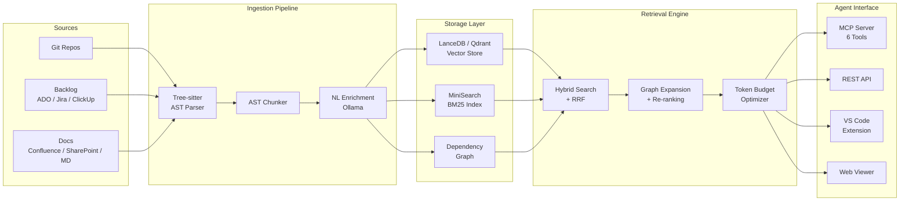

# CodeRAG

**Intelligent codebase context engine for AI coding agents.**

[](https://github.com/maciek-O-digiaidev/CodeRAG/actions/workflows/ci.yml)
[](https://www.npmjs.com/package/@code-rag/core)
[](LICENSE)
[](https://nodejs.org/)
[](https://www.typescriptlang.org/)
[](packages/)

CodeRAG creates a semantic vector database (RAG) from your source code, documentation, and project backlog, then exposes it as [MCP](https://modelcontextprotocol.io/) tools that give AI agents deep understanding of your entire codebase.

---

## Features

- **AST-based code parsing** -- Tree-sitter parses source code into semantically meaningful chunks (functions, classes, methods), not arbitrary line splits
- **Natural language enrichment** -- Each code chunk is summarized in plain English before embedding, improving search quality by up to 10x
- **Hybrid search** -- Combines vector similarity (semantic) with BM25 (keyword) using Reciprocal Rank Fusion
- **Dependency graph expansion** -- After finding relevant chunks, expands results using the code dependency graph (tests, interfaces, callers)
- **Token budget optimization** -- Assembles context within an agent's token budget, prioritized by relevance
- **MCP server with 6 tools** -- `coderag_search`, `coderag_context`, `coderag_explain`, `coderag_status`, `coderag_docs`, `coderag_backlog`
- **Incremental indexing** -- Only changed files are re-processed on subsequent runs
- **Multi-repo support** -- Index and search across multiple repositories seamlessly
- **Backlog integration** -- Azure DevOps, Jira, and ClickUp support
- **Documentation indexing** -- Markdown, Confluence, and SharePoint
- **Multiple embedding providers** -- Auto (default, manages Ollama lifecycle), Ollama, OpenAI-compatible, Voyage, OpenAI
- **Multiple vector stores** -- LanceDB (embedded, zero-infra), Qdrant
- **Web viewer** -- Dashboard, search playground, dependency graph, UMAP embedding explorer
- **VS Code extension** -- Search panel and auto-MCP configuration
- **REST API server** -- Team/cloud deployment with auth, RBAC, and audit logging
- **Local-first, privacy-first** -- Everything works offline; code never leaves your machine without explicit opt-in

## Architecture



## Quick Start

**Prerequisites:** [Node.js](https://nodejs.org/) >= 20, [Ollama](https://ollama.com/) running with `nomic-embed-text` and `qwen2.5-coder:7b` models pulled.

```bash
# 1. Install
npm install -g @code-rag/cli

# 2. Initialize in your project directory
coderag init

# 3. Index your codebase
coderag index

# 4. Search
coderag search "how does authentication work"
```

That is it. CodeRAG will parse your code into AST chunks, enrich them with natural language summaries, create embeddings, and build a hybrid search index. Subsequent `coderag index` runs are incremental -- only changed files are re-processed.

### Start the MCP server for AI agents

```bash
# stdio transport (default, for direct agent integration)
coderag serve

# SSE transport (for network access)
coderag serve --port 3000
```

### Connect to Claude Desktop

Add to your Claude Desktop MCP config (`~/Library/Application Support/Claude/claude_desktop_config.json` on macOS):

```json
{
  "mcpServers": {
    "coderag": {
      "command": "npx",
      "args": ["coderag", "serve"],
      "cwd": "/path/to/your/project"
    }
  }
}
```

## Packages

| Package | npm | Description |
|---------|-----|-------------|
| [`@code-rag/core`](packages/core/) | `@code-rag/core` | Core library -- ingestion, embedding, retrieval, auth |
| [`@code-rag/cli`](packages/cli/) | `@code-rag/cli` | CLI tool -- `coderag init/index/search/serve/status/viewer` |
| [`@code-rag/mcp-server`](packages/mcp-server/) | `@code-rag/mcp-server` | MCP server -- stdio + SSE transport |
| [`@code-rag/api-server`](packages/api-server/) | `@code-rag/api-server` | Express REST API -- team/cloud deployment |
| [`@code-rag/viewer`](packages/viewer/) | (private) | Vite SPA -- dashboard, search, graph, UMAP |
| [`code-rag-vscode`](packages/vscode-extension/) | (private) | VS Code extension -- search panel, auto-config |
| [`@code-rag/benchmarks`](packages/benchmarks/) | (private) | Benchmark suite -- precision, recall, MRR |

## CLI Commands

| Command | Description |
|---------|-------------|
| `coderag init` | Initialize a new project (creates `.coderag.yaml` and `.coderag/` storage) |
| `coderag index` | Index the codebase (incremental by default, `--full` for rebuild) |
| `coderag search <query>` | Hybrid search with `--language`, `--type`, `--file`, `--top-k` filters |
| `coderag serve` | Start MCP server (stdio default, `--port` for SSE) |
| `coderag status` | Show index health and statistics (`--json` for machine output) |
| `coderag viewer` | Launch the web-based viewer UI (`--port`, `--no-open`) |

## Web Viewer

CodeRAG includes a built-in web viewer for visually exploring your indexed codebase.

```bash
coderag viewer
```

Opens `http://localhost:3333` with five views:

| View | Description |
|------|-------------|
| **Dashboard** | Index stats -- chunks, files, languages, last indexed |
| **Chunk Browser** | Browse and filter all indexed chunks with source preview |
| **Search Playground** | Interactive hybrid search with relevance scores |
| **Dependency Graph** | Visual import/export/call graph across modules |
| **Embedding Explorer** | 2D/3D UMAP scatter plot of chunk embeddings |

See [`packages/viewer/`](packages/viewer/) for details.

## MCP Tools

| Tool | Description |
|------|-------------|
| `coderag_search` | Semantic + keyword hybrid search across the codebase |
| `coderag_context` | Assemble relevant context within a token budget |
| `coderag_explain` | Explain a code symbol with full surrounding context |
| `coderag_status` | Check index health and statistics |
| `coderag_docs` | Search indexed documentation (Markdown, Confluence, SharePoint) |
| `coderag_backlog` | Query project backlog items (ADO, Jira, ClickUp) |

## Tech Stack

| Category | Technology |
|----------|-----------|
| Language | TypeScript (Node.js, ESM, strict mode) |
| Code parsing | Tree-sitter (WASM bindings) |
| Embedding (local) | Ollama + nomic-embed-text |
| Embedding (API) | Voyage voyage-code-3, OpenAI text-embedding-3-small |
| Vector DB | LanceDB (embedded), Qdrant (external) |
| Keyword search | MiniSearch (BM25) |
| NL enrichment | Ollama (qwen2.5-coder, llama3.2) |
| MCP | @modelcontextprotocol/sdk |
| CLI | Commander.js |
| Testing | Vitest (2,037 tests) |
| Package manager | pnpm workspaces |

## Benchmarks

Evaluated on 55 curated queries against the CodeRAG codebase itself (easy/medium/hard, function lookups to cross-file reasoning). Grep uses keyword extraction as a baseline.

| Metric | grep | CodeRAG | Improvement |
|--------|------|---------|-------------|
| **Precision@5** | 0.055 | 0.138 | 2.5x |
| **Recall@10** | 0.485 | 0.636 | 1.3x |
| **MRR** | 0.161 | 0.395 | 2.4x |
| **nDCG@10** | 0.221 | 0.437 | 2.0x |

Run `pnpm benchmark` to reproduce. See [`packages/benchmarks/`](packages/benchmarks/) for the full dataset and methodology.

## Documentation

| Page | Description |
|------|-------------|
| [Installation](docs/installation.md) | Prerequisites, three installation methods |
| [Configuration](docs/configuration.md) | Full `.coderag.yaml` reference |
| [Troubleshooting](docs/troubleshooting.md) | Common issues and solutions |
| [Viewer](packages/viewer/) | Web viewer -- dashboard, search, graph, embeddings |

See the [`docs/`](docs/) directory for additional documentation.

## Development

```bash
# Clone and install
git clone https://github.com/maciek-O-digiaidev/CodeRAG.git
cd CodeRAG
pnpm install

# Build all packages
pnpm build

# Run tests
pnpm test

# Run benchmarks
pnpm benchmark
```

## License

[MIT](LICENSE)
