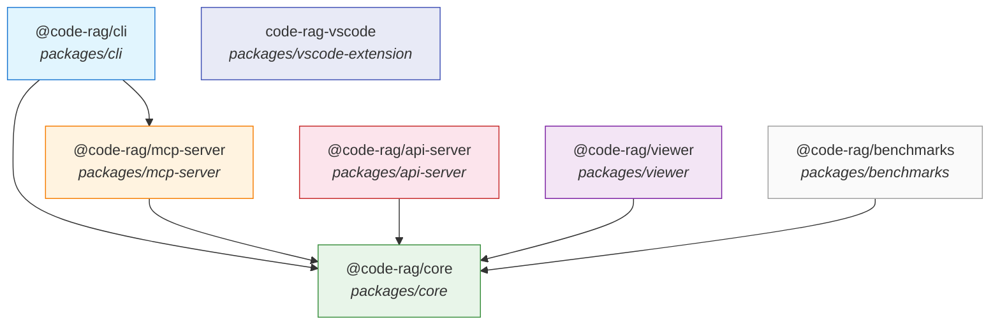
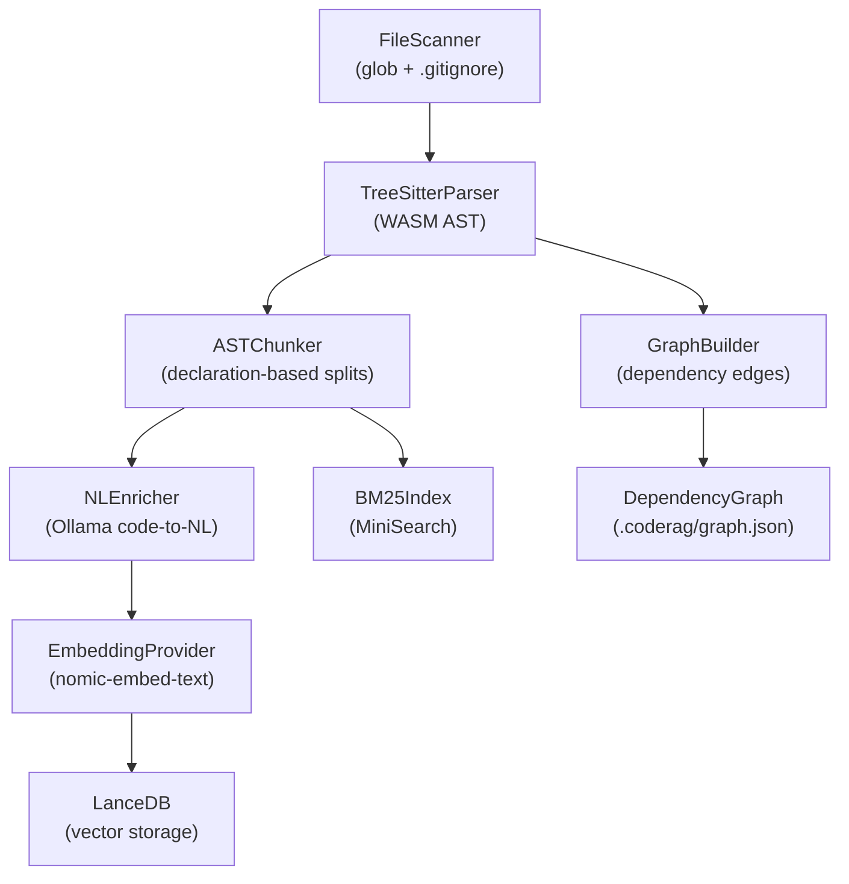
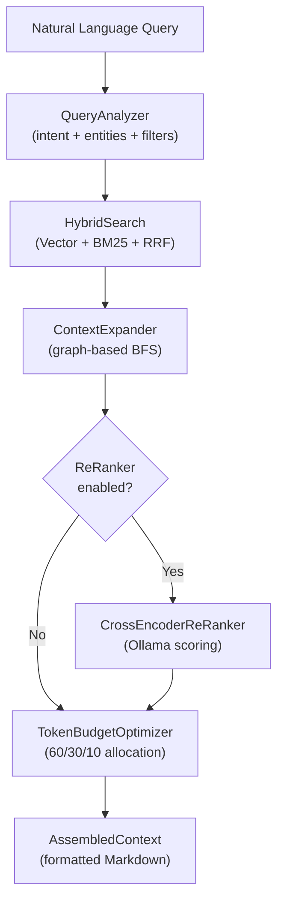
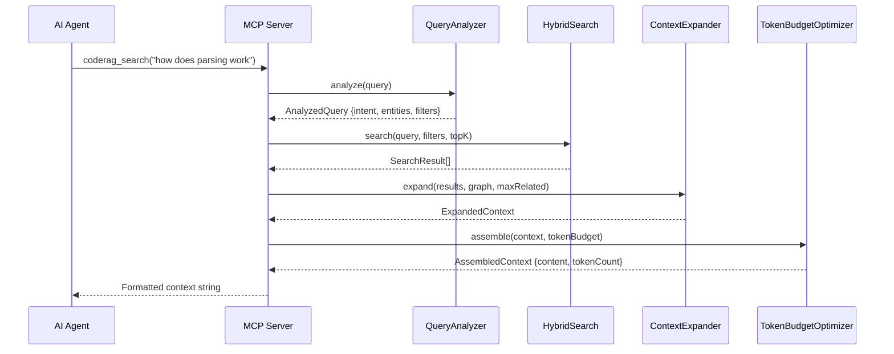

# Architecture Overview

This document provides a contributor-oriented overview of CodeRAG's architecture. It covers the package dependency graph, the ingestion and retrieval pipelines, the MCP server request flow, and the key design decisions that shape the system.

For deeper dives into individual topics, see the files in `docs/architecture/`.

---

## What is CodeRAG?

CodeRAG is an intelligent codebase context engine for AI coding agents. It creates a semantic vector database (RAG) from source code, documentation, and project backlog, then exposes it as MCP tools that give AI agents deep understanding of the entire codebase.

The system is **local-first and privacy-preserving** -- all processing happens on the developer's machine by default. Cloud features (API server, team sharing) are opt-in.

---

## High-Level Architecture

```mermaid
flowchart LR
    subgraph Sources
        Git["Git Repos"]
        Jira["Jira / ADO"]
        Confluence["Confluence"]
        MD["Markdown / Docs"]
    end

    subgraph Ingestion["Ingestion Pipeline"]
        Parser["Tree-sitter AST\nParser"]
        Chunker["AST-based\nChunker"]
        Enricher["NL Enrichment\n(Ollama)"]
    end

    subgraph Storage["Embedding & Storage"]
        LanceDB["LanceDB\n(Vector DB)"]
        BM25["MiniSearch\n(BM25 Index)"]
        Graph["Dependency\nGraph"]
    end

    subgraph Retrieval["Retrieval Engine"]
        Hybrid["Hybrid Search\n(Vector + BM25 + RRF)"]
        Expand["Graph\nExpansion"]
        Rerank["Re-ranking"]
        Budget["Token Budget\nOptimizer"]
    end

    subgraph Interface["Agent Interface"]
        MCP["MCP Server"]
        CLI["CLI"]
        API["REST API"]
        Viewer["Web Viewer"]
        VSCode["VS Code\nExtension"]
    end

    Sources --> Ingestion
    Ingestion --> Storage
    Storage --> Retrieval
    Retrieval --> Interface
```

---

## Package Dependency Graph

CodeRAG is a **pnpm workspace monorepo** with 7 packages. The dependency graph flows from `core` outward:

| Package | Purpose | Key Dependencies |
|---------|---------|-----------------|
| **@code-rag/core** | Ingestion, embedding, retrieval, graph, backlog | neverthrow, web-tree-sitter, @lancedb/lancedb, minisearch |
| **@code-rag/cli** | CLI commands (init, index, search, serve, status, viewer) | @code-rag/core, @code-rag/mcp-server, commander |
| **@code-rag/mcp-server** | MCP tools (coderag_search, coderag_context, etc.) | @code-rag/core, @modelcontextprotocol/sdk |
| **@code-rag/api-server** | REST API with auth, RBAC, team features | @code-rag/core, express |
| **@code-rag/viewer** | Web-based dashboard and visualization | @code-rag/core, vite |
| **code-rag-vscode** | VS Code extension with search panel | VS Code API, MCP client |
| **@code-rag/benchmarks** | Performance and quality benchmarks | @code-rag/core |

**Build order**: `core` must build first, then all other packages can build in parallel. The CLI depends on both `core` and `mcp-server`.

---

## Ingestion Pipeline

The ingestion pipeline transforms raw source files into semantically meaningful, NL-enriched chunks ready for embedding and storage.

### Stages

1. **File Scanning** -- Discovers source files, respects `.gitignore` and `.coderagignore`, computes SHA-256 hashes for incremental dirty detection.

2. **Tree-sitter Parsing** -- Parses each source file into an AST using language-specific WASM grammars. Extracts top-level declaration names (functions, classes, interfaces, etc.). Supports 12 languages: TypeScript, JavaScript, TSX, Python, Go, Rust, Java, C#, C, C++, Ruby, PHP.

3. **AST-based Chunking** -- Splits parsed files along declaration boundaries rather than arbitrary line counts. Each function, class, or interface becomes its own chunk. Oversized chunks are split at logical points (blank lines, closing braces). Chunk IDs are deterministic: `SHA-256(filePath + startLine + content)`.

4. **NL Enrichment** -- Translates each code chunk into a natural language summary using Ollama (qwen2.5-coder). This step is optional but yields significant improvement in retrieval quality. Enrichment failures are non-fatal: chunks proceed with an empty summary.

5. **Embedding and Storage** -- Chunks are embedded via the configured `EmbeddingProvider` and stored in LanceDB (vector search) and MiniSearch (BM25 keyword search) in parallel.

6. **Dependency Graph** -- Import statements are resolved to build a graph of file dependencies. The graph is serialized to `.coderag/graph.json` for use during retrieval.

### Incremental Indexing

Only changed files are re-processed. The `IncrementalIndexer` compares filesystem SHA-256 hashes against the stored `IndexState` to identify added, modified, and deleted files. Unchanged files keep their existing index entries.

---

## Retrieval Pipeline

The retrieval pipeline transforms a natural language query into a token-budgeted context window suitable for an AI agent.

### Stages

1. **Query Analysis** -- Pattern-based (no LLM required). Detects intent (`find_definition`, `find_usage`, `understand_module`, `find_similar`, `general`), extracts entities (file paths, class/function names), suggests filters (language, chunk type), and expands search terms with synonyms.

2. **Hybrid Search** -- Embeds the query and runs both vector similarity search (LanceDB cosine) and BM25 keyword search (MiniSearch) in parallel. Results are merged using Reciprocal Rank Fusion (RRF) with configurable weights.

3. **Context Expansion** -- BFS traversal of the dependency graph from primary results (max depth 2). Discovers related tests, interfaces, callers, and siblings. Adds them as supplementary context.

4. **Re-ranking (Optional)** -- Cross-encoder re-ranking via Ollama. Each result is scored by an LLM for relevance to the query. Adds latency but improves precision for complex queries.

5. **Token Budget Optimization** -- Assembles the final context within a configurable token limit (default 8,000). Budget allocation: 60% primary results, 30% related context, 10% graph excerpt. Outputs formatted Markdown.

---

## MCP Server Request Flow

The MCP server is the primary interface for AI agents. It exposes tools via the Model Context Protocol over stdio or SSE transport.

### MCP Tools

| Tool | Purpose |
|------|---------|
| `coderag_search` | Search the codebase with a natural language query |
| `coderag_context` | Get deep context for a specific file or symbol |
| `coderag_explain` | Get an AI-generated explanation of a code section |
| `coderag_status` | Check index health, chunk count, and last indexing time |
| `coderag_docs` | Search documentation (Markdown, Confluence, SharePoint) |
| `coderag_backlog` | Search project backlog items (ADO, Jira, ClickUp) |

---

## Key Design Decisions

### 1. NL Enrichment Before Embedding

Code is translated to natural language summaries before embedding. Embedding models trained on natural language perform significantly better when given NL descriptions rather than raw code. Research by Greptile demonstrated a 10x improvement in retrieval quality with this approach.

### 2. AST-Based Chunking

Tree-sitter parses code into an Abstract Syntax Tree, and chunks are created along declaration boundaries (functions, classes, interfaces) rather than arbitrary line splits. A 100-line function split at line 50 produces two meaningless fragments; AST chunking preserves complete semantic units.

### 3. Hybrid Search with RRF

Neither vector search nor keyword search alone is sufficient for code. Vector search captures semantic similarity ("find code that does X") while BM25 captures exact token matches ("find usages of `parseConfig`"). Reciprocal Rank Fusion combines both ranking signals into a single sorted result list.

### 4. Graph-Augmented Retrieval

After finding relevant chunks, the dependency graph expands results to include related code: tests for the found function, interfaces it implements, files that import it. This gives AI agents the full context needed to understand and modify code correctly.

### 5. Token Budget Optimization

AI agents have limited context windows. The token budget optimizer assembles context within a configurable limit, prioritizing the most relevant results. The 60/30/10 allocation (primary/related/graph) balances precision with breadth.

### 6. Provider Pattern

All external dependencies sit behind interfaces (`EmbeddingProvider`, `VectorStore`, `BacklogProvider`, `ReRanker`, `LLMProvider`, `Parser`). This allows swapping Ollama for OpenAI, LanceDB for Qdrant, or ADO for Jira by changing configuration -- no code changes required.

### 7. Local-First

Everything works offline with Ollama and LanceDB. No cloud services required. Code never leaves the machine without explicit opt-in. Cloud features (API server, team sharing, enterprise auth) are entirely optional.

---

## Performance Targets

| Metric | Target |
|--------|--------|
| **Indexing** | 50,000 LOC in under 5 minutes |
| **Query latency** | Under 500ms end-to-end |
| **Token budget** | Configurable (default 8,000 tokens) |

---

## Further Reading

- [`./architecture/ingestion-pipeline.md`](./architecture/ingestion-pipeline.md) -- Detailed ingestion pipeline documentation
- [`./architecture/retrieval-pipeline.md`](./architecture/retrieval-pipeline.md) -- Detailed retrieval pipeline documentation
- [`./architecture/dependency-graph.md`](./architecture/dependency-graph.md) -- Graph data model and traversal
- [`./architecture/hybrid-search.md`](./architecture/hybrid-search.md) -- Vector + BM25 fusion algorithm
- [`./architecture/design-decisions.md`](./architecture/design-decisions.md) -- ADR-style records for all key decisions
- [`./extending.md`](./extending.md) -- How to add new providers and parsers
