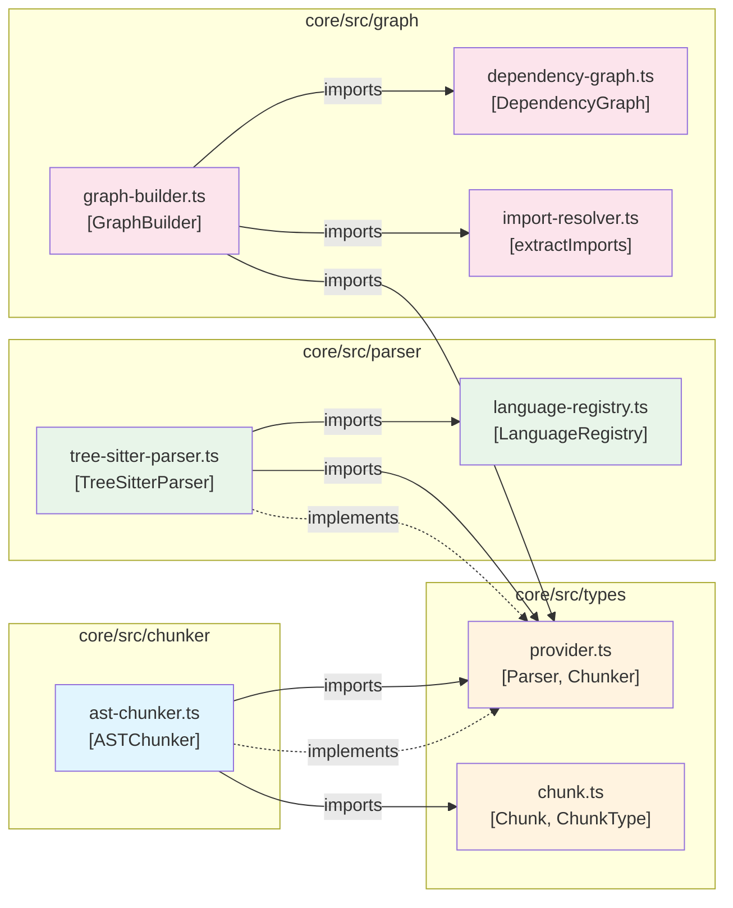
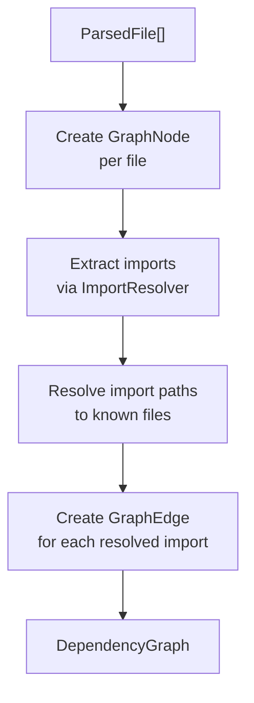
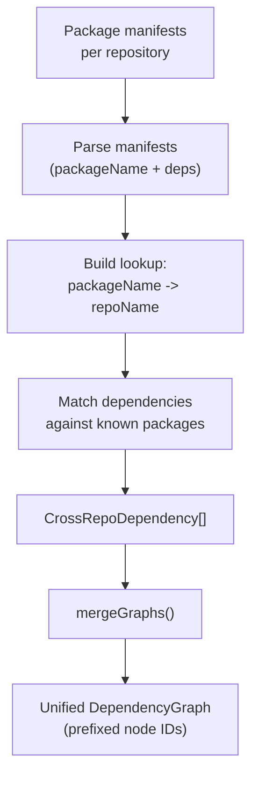
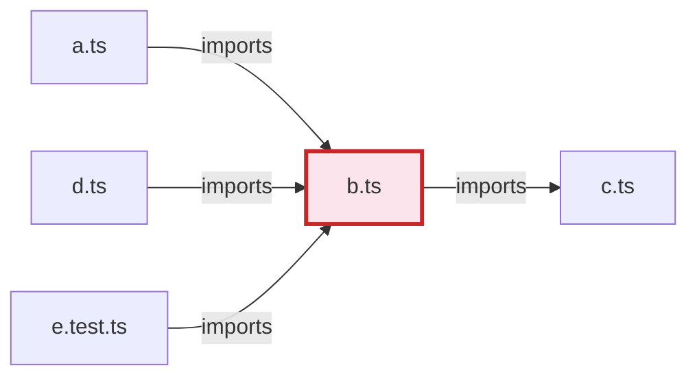

---
tags:
  - architecture
  - graph
  - dependencies
  - cross-repo
aliases:
  - Dependency Graph
  - Code Graph
  - Import Graph
---

# Dependency Graph

The dependency graph tracks relationships between files and symbols across the codebase. It is used during [retrieval](retrieval-pipeline.md) to expand search results with related code (tests, interfaces, callers, siblings) and during [ingestion](ingestion-pipeline.md) to model the structure of the project.

## Graph Data Model

The graph is a directed multigraph where nodes represent files/modules and edges represent dependency relationships.

### Node Structure

```typescript
interface GraphNode {
  id: string;          // Normalized file path (forward slashes)
  filePath: string;    // Relative path from project root
  symbols: string[];   // Top-level declaration names in the file
  type: 'module' | 'class' | 'function';
}
```

### Edge Structure

```typescript
interface GraphEdge {
  source: string;      // Source node ID (the file that imports/depends)
  target: string;      // Target node ID (the file being imported)
  type: 'imports' | 'extends' | 'implements' | 'calls';
}
```

### Edge Types

| Type | Meaning | Example |
|------|---------|---------|
| `imports` | Source file imports from target file | `parser.ts` imports from `types.ts` |
| `extends` | Source class extends target class | `AdvancedParser extends BaseParser` |
| `implements` | Source class implements target interface | `OllamaEmbed implements EmbeddingProvider` |
| `calls` | Source function calls target function | `index() calls parse()` |

## Example Graph



## GraphBuilder

The `GraphBuilder` constructs the dependency graph from a collection of parsed files.

### Construction Algorithm



1. **Node creation**: Each `ParsedFile` becomes a `GraphNode`. The node ID is the file path normalized to forward slashes. Symbols are the declaration names extracted by Tree-sitter.

2. **Import extraction**: The `extractImports()` function uses regex patterns to find import statements in the source code.

3. **Path resolution**: Each import source is resolved to a file path known to the project:
   - Bare specifiers (npm packages, built-ins) are skipped
   - Relative paths are resolved from the importing file's directory
   - ESM convention: `.js` extensions are stripped and tried with `.ts`, `.tsx`, `.js`, `.jsx`
   - Index resolution: `./foo` tries `./foo/index.ts`, `./foo/index.js`, etc.

4. **Edge creation**: Each resolved import produces an `imports` edge from the importing file to the imported file.

```typescript
class GraphBuilder {
  constructor(rootDir: string);
  buildFromFiles(files: ParsedFile[]): Result<DependencyGraph, GraphError>;
}
```

## ImportResolver

The `extractImports()` function supports multiple languages and import styles:

### JavaScript / TypeScript

| Pattern | Example |
|---------|---------|
| Named imports | `import { ok, err } from 'neverthrow'` |
| Default import | `import TSParser from 'web-tree-sitter'` |
| Default + named | `import React, { useState } from 'react'` |
| Namespace import | `import * as path from 'node:path'` |
| Side-effect import | `import './styles.css'` |
| Dynamic import | `import('./module')` |
| CommonJS require | `const fs = require('fs')` |
| Re-exports (named) | `export { Foo } from './foo'` |
| Re-exports (all) | `export * from './utils'` |
| Type-only import | `import type { Config } from './config'` |

### Python

| Pattern | Example |
|---------|---------|
| From import | `from module import a, b, c` |
| Simple import | `import os` |
| Aliased import | `import numpy as np` |

### Go

| Pattern | Example |
|---------|---------|
| Single import | `import "fmt"` |
| Import block | `import ( "fmt" "os" )` |
| Aliased import | `import f "fmt"` |

```typescript
interface ImportInfo {
  source: string;        // The import specifier ("./foo", "react", "fmt")
  specifiers: string[];  // Named imports (["ok", "err"])
  isDefault: boolean;    // Whether this is a default import
  isDynamic: boolean;    // Whether this is a dynamic import()
}
```

## CrossRepoResolver

For multi-repository setups, the `CrossRepoResolver` detects and models dependencies between repositories by analyzing package manifests.

### Supported Manifests

| File | Parser | Ecosystem |
|------|--------|-----------|
| `package.json` | `parsePackageJson()` | npm (JS/TS) |
| `go.mod` | `parseGoMod()` | Go modules |
| `Cargo.toml` | `parseCargoToml()` | Rust Cargo |

### Cross-Repo Resolution Flow



1. **Parse manifests**: Extract `packageName` and `dependencies` from each repo's manifest
2. **Build lookup**: Map each published package name to its repository
3. **Match cross-repo deps**: For each repo's dependencies, check if the package name belongs to another repo
4. **Merge graphs**: Combine per-repo graphs into a unified graph with prefixed node IDs (`repoName::filePath`)

```typescript
interface CrossRepoDependency {
  sourceRepo: string;
  targetRepo: string;
  sourceChunkId: string;
  targetPackage: string;
  dependencyType: 'npm' | 'go' | 'cargo' | 'pip' | 'api';
}
```

> **Note: Node IDs in the merged graph are prefixed with the repository name to avoid collisions: `my-repo::src/index.ts`. Cross-repo edges connect representative root nodes of each repository.**

## ReadonlyGraph Interface

Consumers of the graph (like [ContextExpander](retrieval-pipeline.md)) depend on a `ReadonlyGraph` interface rather than the concrete `DependencyGraph` class. This dependency inversion allows the graph implementation to change without affecting retrieval logic.

```typescript
interface ReadonlyGraph {
  getNode(id: string): GraphNode | undefined;
  getEdges(nodeId: string): GraphEdge[];
  getIncomingEdges(nodeId: string): GraphEdge[];
}
```

The `DependencyGraph` class implements `ReadonlyGraph` and also provides mutation methods (`addNode`, `addEdge`) and query methods (`getDependencies`, `getDependents`, `getRelatedNodes`).

## Graph Traversal

The `DependencyGraph` provides a BFS traversal method for finding related nodes:

```typescript
// Find all nodes within maxDepth hops (both directions)
getRelatedNodes(nodeId: string, maxDepth?: number): Set<string>
```

The traversal follows **both outgoing and incoming edges**, meaning it finds:
- Files that the target depends on (outgoing `imports`)
- Files that depend on the target (incoming `imports`)
- Transitive relationships up to `maxDepth` (default 2)



Starting from `b.ts` with `maxDepth=2`:
- **Hop 1**: `a.ts` (incoming), `c.ts` (outgoing), `d.ts` (incoming), `e.test.ts` (incoming)
- **Hop 2**: Anything connected to hop-1 nodes

## Graph Serialization

The graph supports JSON serialization for persistence:

```typescript
// Serialize
const json = graph.toJSON(); // { nodes: GraphNode[], edges: GraphEdge[] }

// Deserialize
const restored = DependencyGraph.fromJSON(json);
```

The serialized graph is stored at `.coderag/graph.json` and loaded on subsequent indexing runs to avoid rebuilding from scratch.

## Graph Statistics

```typescript
graph.nodeCount();   // Number of files in the graph
graph.edgeCount();   // Number of dependency edges
graph.getAllNodes();  // All GraphNode objects
graph.getAllEdges();  // All GraphEdge objects
```

## Related Pages

- [Overview](overview.md) -- System architecture overview
- [Ingestion Pipeline](ingestion-pipeline.md) -- How the graph is built during indexing
- [Retrieval Pipeline](retrieval-pipeline.md) -- How the graph is used for context expansion
- [Design Decisions](design-decisions.md) -- ADR for graph expansion strategy
