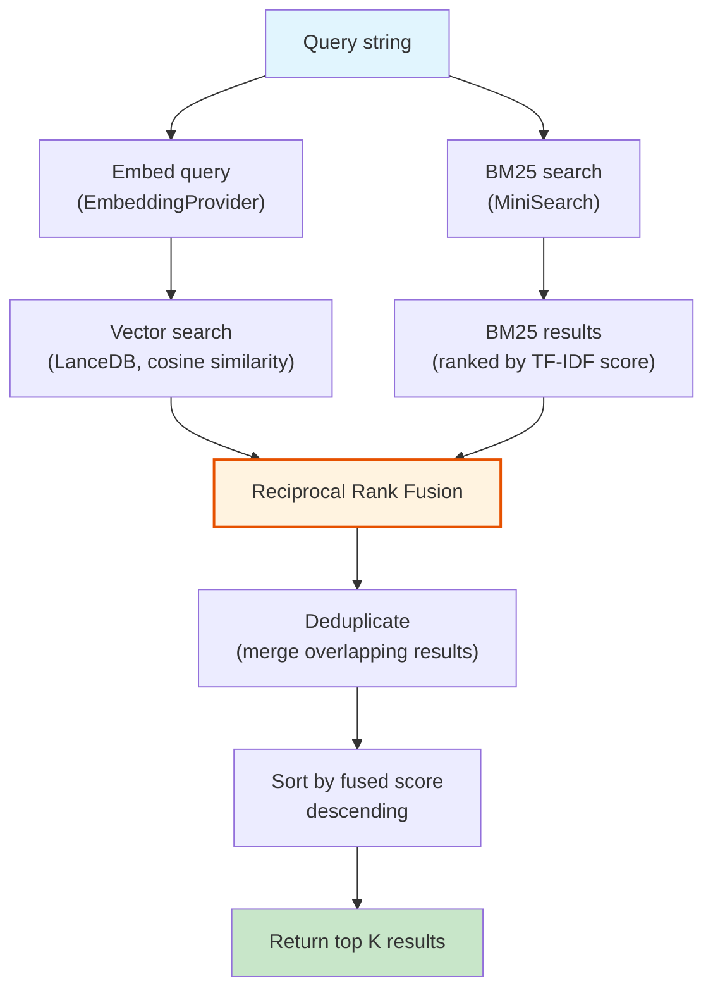

---
tags:
  - architecture
  - search
  - hybrid
  - bm25
  - vector
  - rrf
aliases:
  - Hybrid Search
  - Reciprocal Rank Fusion
  - RRF
  - BM25
---

# Hybrid Search

CodeRAG combines two complementary search strategies -- vector (semantic) similarity and BM25 (keyword) matching -- and fuses their results using Reciprocal Rank Fusion (RRF). This hybrid approach overcomes the weaknesses of either strategy used alone.

## Why Hybrid?

> **Info: The Semantic vs Keyword Trade-off**
> **Vector search** excels at finding semantically similar code even when the exact terms differ ("authentication handler" matches `loginController`), but struggles with exact identifiers and rare tokens.
>
> **BM25 keyword search** excels at finding exact identifier matches (`TreeSitterParser`, `parseGoMod`), but cannot understand paraphrases or conceptual similarity.
>
> Combining both captures the best of each world.

| Capability | Vector Only | BM25 Only | Hybrid |
|-----------|:-----------:|:---------:|:------:|
| Semantic similarity | Yes | No | Yes |
| Exact identifier match | Weak | Yes | Yes |
| Paraphrase understanding | Yes | No | Yes |
| Rare token retrieval | Weak | Yes | Yes |
| Typo tolerance | Partial | Yes (fuzzy) | Yes |
| Cross-language concepts | Yes | No | Yes |

## Architecture



## Vector Search Flow

1. The query string is passed to the `EmbeddingProvider` to generate a query embedding vector
2. LanceDB performs approximate nearest neighbor (ANN) search using cosine similarity
3. Returns top `2 * topK` results ranked by cosine distance (over-fetching for better RRF coverage)

The embedding provider is configurable:

| Provider | Model | Dimensions | Local? |
|----------|-------|:----------:|:------:|
| Ollama (default) | nomic-embed-text | 768 | Yes |
| Voyage AI | voyage-code-3 | 1024 | No |
| OpenAI | text-embedding-3-small | 1536 | No |

> **Tip: Embeddings are computed over both the code content and the NL summary (`nlSummary`), which significantly improves semantic matching. See [Design Decisions](design-decisions.md#nl-enrichment).**

## BM25 Search Flow

The `BM25Index` is built on [MiniSearch](https://github.com/lucamel/minisearch), an in-memory full-text search library.

### Indexed Fields

| Field | Boost | Description |
|-------|:-----:|-------------|
| `nlSummary` | 2.0x | NL description (highest signal) |
| `name` | 1.5x | Declaration name |
| `content` | 1.0x | Raw code content |
| `filePath` | 0.5x | File path (lowest weight) |

### Search Options

| Option | Value | Description |
|--------|-------|-------------|
| `prefix` | `true` | Prefix matching enabled (e.g., "parse" matches "parser") |
| `fuzzy` | `0.2` | 20% fuzzy tolerance for typos |

### BM25 Index Operations

```typescript
class BM25Index {
  addChunks(chunks: Chunk[]): void;       // Index new chunks
  removeChunks(ids: string[]): void;      // Remove chunks by ID (discard)
  search(query: string, topK: number): SearchResult[];
  serialize(): string;                     // JSON serialization
  static deserialize(json: string): BM25Index;  // Restore from JSON
  count(): number;                         // Number of indexed documents
}
```

> **Note: The BM25 index is fully in-memory and serializable. It is persisted alongside the vector store and restored on startup to avoid re-indexing.**

## Reciprocal Rank Fusion (RRF)

RRF is a rank-based fusion algorithm that combines multiple ranked lists into a single ranking without requiring score normalization. This is critical because vector similarity scores and BM25 scores are on completely different scales.

### Formula

For each document `d` appearing in one or more ranked lists:

```
RRF_score(d) = SUM over all lists L:  1 / (k + rank_L(d))
```

Where:
- `k` is a constant (CodeRAG uses `k = 60`, the standard value from the original RRF paper)
- `rank_L(d)` is the 0-based rank of document `d` in list `L`
- If `d` does not appear in a list, its contribution from that list is 0

### Weighted RRF

CodeRAG extends RRF with configurable weights per search method:

```
score(d) = vectorWeight * (1 / (k + vectorRank(d)))
          + bm25Weight * (1 / (k + bm25Rank(d)))
```

| Parameter | Default | Description |
|-----------|:-------:|-------------|
| `vectorWeight` | 1.0 | Weight for vector search RRF scores |
| `bm25Weight` | 1.0 | Weight for BM25 RRF scores |
| `topK` | 10 | Number of final results to return |
| `k` (RRF constant) | 60 | Smoothing constant (higher = less top-heavy) |

### Worked Example

Given a query, suppose vector search returns `[A, B, C, D]` and BM25 returns `[C, E, A, F]`:

| Document | Vector Rank | BM25 Rank | Vector RRF | BM25 RRF | Combined |
|:--------:|:-----------:|:---------:|:----------:|:--------:|:--------:|
| A | 0 | 2 | 1/61 = 0.0164 | 1/63 = 0.0159 | **0.0323** |
| B | 1 | -- | 1/62 = 0.0161 | 0 | 0.0161 |
| C | 2 | 0 | 1/63 = 0.0159 | 1/61 = 0.0164 | **0.0323** |
| D | 3 | -- | 1/64 = 0.0156 | 0 | 0.0156 |
| E | -- | 1 | 0 | 1/62 = 0.0161 | 0.0161 |
| F | -- | 3 | 0 | 1/64 = 0.0156 | 0.0156 |

**Final ranking**: A, C (tied at 0.0323), then B, E, D, F.

Documents found by both methods get boosted, which is exactly the desired behavior -- agreement between semantic and keyword signals indicates high relevance.

### Why RRF Over Score Normalization?

> **Warning: Score normalization pitfalls**
> Normalizing scores (e.g., min-max scaling) is fragile because:
> - Vector cosine scores cluster tightly (e.g., 0.78-0.85) while BM25 scores can vary wildly
> - Score distributions change per query
> - Outlier scores can distort the normalization
>
> RRF uses only rank positions, making it robust regardless of score distribution. It requires no calibration and works reliably across different embedding models and BM25 configurations.

## Implementation Details

The `HybridSearch` class orchestrates the full flow:

```typescript
class HybridSearch {
  constructor(
    vectorStore: VectorStore,
    bm25Index: BM25Index,
    embeddingProvider: EmbeddingProvider,
    config: SearchConfig,
  );

  async search(
    query: string,
    options?: SearchOptions,
  ): Promise<Result<SearchResult[], EmbedError>>;
}
```

The implementation:
1. Embeds the query via `EmbeddingProvider`
2. Runs vector search on `VectorStore` (top `2*topK`)
3. Runs BM25 search on `BM25Index` (top `2*topK`)
4. Builds a fused score map keyed by chunk ID
5. For each result, computes weighted RRF score
6. Deduplicates (chunks in both lists get combined scores)
7. Sorts by fused score descending
8. Returns top `topK` with `method: 'hybrid'`

## Performance Characteristics

| Metric | Vector Search | BM25 Search | RRF Fusion |
|--------|:------------:|:-----------:|:----------:|
| Latency | ~50-200ms (embedding + ANN) | ~1-5ms (in-memory) | <1ms |
| Memory | LanceDB file-backed | In-memory index | Negligible |
| Scaling | Sub-linear (ANN index) | Linear with corpus | Linear with result count |

> **Tip: BM25 is nearly free compared to vector search. The bottleneck is always the embedding step. For low-latency scenarios, consider caching query embeddings.**

## Configuration

These parameters are set in `.coderag.yaml` under the `search` section:

```yaml
search:
  topK: 10
  vectorWeight: 1.0
  bm25Weight: 1.0
```

Or overridden per-query via `SearchOptions`:

```typescript
interface SearchOptions {
  topK?: number;
  vectorWeight?: number;
  bm25Weight?: number;
  filters?: SearchFilters;
}
```

## Related Pages

- [Overview](overview.md) -- System architecture overview
- [Retrieval Pipeline](retrieval-pipeline.md) -- Full retrieval flow using hybrid search
- [Ingestion Pipeline](ingestion-pipeline.md) -- How chunks are indexed into vector store and BM25
- [Design Decisions](design-decisions.md) -- ADR for hybrid search over pure vector
