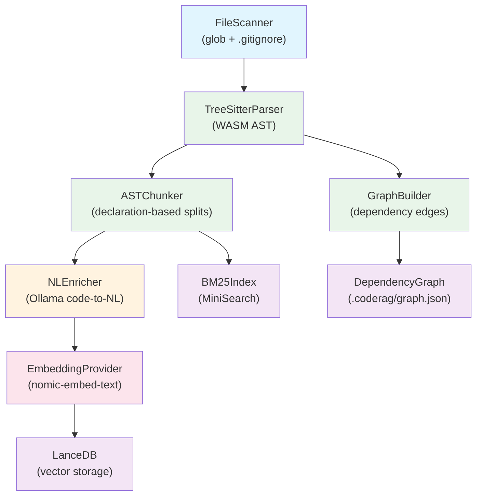
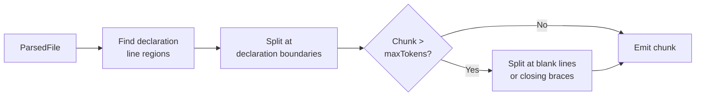
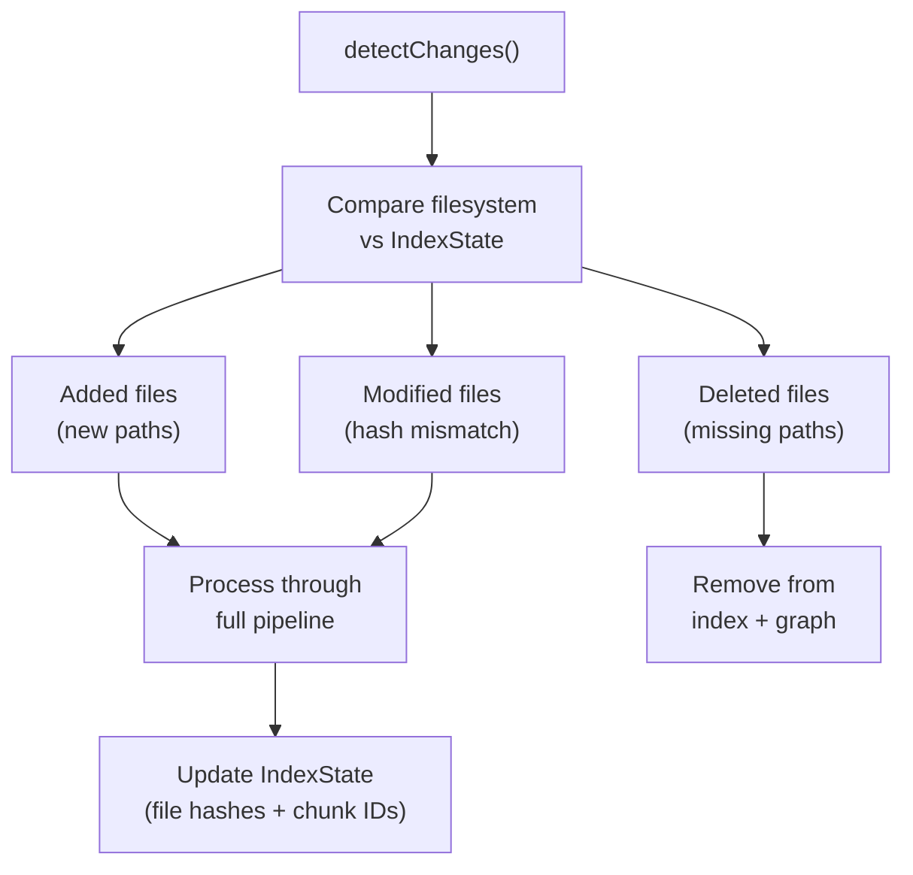

---
tags:
  - architecture
  - pipeline
  - ingestion
  - tree-sitter
  - chunking
aliases:
  - Ingestion Pipeline
  - Indexing Pipeline
---

# Ingestion Pipeline

The ingestion pipeline transforms raw source files into semantically meaningful, NL-enriched chunks ready for embedding and storage. It is the entry point for all code that enters the CodeRAG index.

## Pipeline Overview



## Stage 1: File Scanning

The `FileScanner` discovers source files in the project directory.

| Aspect | Detail |
|--------|--------|
| **Input** | Root directory path |
| **Output** | List of `ScannedFile` (filePath, contentHash) |
| **Respects** | `.gitignore`, `.coderagignore`, binary file exclusion |
| **Hashing** | SHA-256 content hash for incremental dirty detection |

## Stage 2: Tree-sitter Parsing

The `TreeSitterParser` uses Tree-sitter WASM bindings to parse source files into ASTs and extract top-level declarations.

```typescript
// TreeSitterParser implements the Parser interface
interface Parser {
  parse(filePath: string, content: string): Promise<Result<ParsedFile, ParseError>>;
}

interface ParsedFile {
  filePath: string;
  language: string;      // detected from extension via LanguageRegistry
  content: string;
  declarations: string[]; // extracted top-level declaration names
}
```

| Aspect | Detail |
|--------|--------|
| **Input** | File path + content |
| **Output** | `ParsedFile` with language detection and declaration names |
| **Language detection** | Extension-based via `LanguageRegistry` |
| **Supported languages** | TypeScript, JavaScript, Python, Go, Rust, Java, C#, and more |
| **Name extraction** | Walks top-level AST children, tries `name`, `declaration`, `declarator` field strategies |

> [!info] WASM Bindings
> Tree-sitter runs in WASM via `web-tree-sitter`. The runtime must be initialized with `await TSParser.init()` before parsing. Language grammars are loaded lazily per-language.

## Stage 3: AST-Based Chunking

The `ASTChunker` splits parsed files into semantically meaningful chunks aligned with code declarations.



**Chunking strategy:**

1. Map each declaration name to its line range in the source using regex patterns
2. Extract preamble (imports) as a separate `import_block` chunk
3. Each declaration becomes its own chunk with inferred `ChunkType`
4. If a declaration exceeds `maxTokensPerChunk`, split at logical points (blank lines, closing braces `}`)
5. Generate deterministic chunk IDs: `SHA-256(filePath + startLine + content)`

**Chunk types** inferred from content via regex:

| ChunkType | Detection Pattern |
|-----------|------------------|
| `class` | `class Foo`, `abstract class Foo` |
| `interface` | `interface Foo` |
| `type_alias` | `type Foo = ...` |
| `function` | `function foo`, `const foo = (`, `def foo`, `fn foo` |
| `module` | `const/let/var` declarations, fallback |
| `import_block` | `import ...` preamble |
| `doc` | Documentation chunks |

> [!warning] Why Not Line-Based Chunking?
> Arbitrary line splits break semantic boundaries. A 100-line function split at line 50 produces two meaningless fragments. AST-based chunking preserves complete declarations, making each chunk a self-contained unit of meaning. See [[design-decisions#AST-Based Chunking]].

**Token estimation** uses `content.length / 4` as a fast approximation (no tokenizer dependency).

## Stage 4: NL Enrichment

The `NLEnricher` translates each code chunk into a natural language summary using Ollama.

```typescript
class NLEnricher {
  async enrichChunk(chunk: Chunk): Promise<Result<Chunk, EnrichmentError>>;
  async enrichBatch(chunks: Chunk[], concurrency?: number): Promise<Result<Chunk[], EnrichmentError>>;
}
```

| Aspect | Detail |
|--------|--------|
| **Input** | `Chunk` with code content |
| **Output** | Same `Chunk` with `nlSummary` populated |
| **LLM** | Ollama (qwen2.5-coder or llama3.2) |
| **Prompt** | `"Summarize this {language} code in one sentence. Focus on what it does, not how."` |
| **Concurrency** | Configurable batch concurrency (default 3) |
| **Error handling** | Enrichment failures are non-fatal; chunk keeps empty `nlSummary` |

> [!tip] Why Enrich Before Embedding?
> Embedding models trained on natural language perform significantly better when given NL descriptions rather than raw code. Greptile's research showed a **10x improvement** in retrieval quality with NL enrichment. The `nlSummary` field is embedded alongside the code content. See [[design-decisions#NL Enrichment]].

## Stage 5: Embedding & Storage

After enrichment, chunks are embedded and stored in two parallel indices:

1. **LanceDB** (vector store) -- stores chunk embeddings for semantic similarity search
2. **BM25Index** (MiniSearch) -- stores chunk text for keyword matching

The `EmbeddingProvider` interface abstracts the embedding backend:

| Provider | Model | Dimension |
|----------|-------|-----------|
| Ollama (default) | nomic-embed-text | 768 |
| Voyage AI | voyage-code-3 | 1024 |
| OpenAI | text-embedding-3-small | 1536 |

## Stage 6: Dependency Graph Construction

In parallel with chunking, the `GraphBuilder` constructs a [[dependency-graph]] from parsed files:

1. Each file becomes a `GraphNode` (id, filePath, symbols, type)
2. The `ImportResolver` extracts import statements via regex (ES6, Python, Go, CommonJS)
3. Import paths are resolved to known file paths (with extension fallbacks: `.ts`, `.tsx`, `.js`)
4. Resolved imports become `GraphEdge` entries (type: `imports`, `extends`, `implements`, `calls`)

The graph is serialized to `.coderag/graph.json` for persistence.

## Incremental Indexing

The `IncrementalIndexer` avoids re-processing unchanged files by tracking state:



| Concept | Implementation |
|---------|---------------|
| **Dirty detection** | SHA-256 content hash comparison against `IndexState` |
| **State tracking** | `IndexState` maps `filePath -> { contentHash, lastIndexedAt, chunkIds }` |
| **Change set** | Three lists: `added`, `modified`, `deleted` |
| **Git integration** | Validates root directory is a git repo via `GitClient` |

```typescript
interface ChangeSet {
  added: string[];
  modified: string[];
  deleted: string[];
}

interface IndexerResult {
  added: string[];
  modified: string[];
  deleted: string[];
  unchanged: string[];
  totalChunks: number;
  duration: number;
}
```

> [!note] Only changed files are re-parsed, re-chunked, re-enriched, and re-embedded. Unchanged files keep their existing index entries, making subsequent indexing runs proportional to the size of the change rather than the entire codebase.

## Error Handling

All pipeline stages use the `Result<T, E>` pattern from `neverthrow`:

- `ParseError` -- tree-sitter initialization or parsing failures
- `ChunkError` -- chunking logic failures
- `EnrichmentError` -- Ollama communication failures (non-fatal for the pipeline)
- `EmbedError` -- embedding generation failures
- `IndexerError` -- file scanning or state management failures

> [!warning] Enrichment errors are intentionally non-fatal. If Ollama is unavailable, chunks proceed with an empty `nlSummary`. The embedding will have lower quality but the index remains functional.

## Related Pages

- [[overview]] -- System architecture overview
- [[dependency-graph]] -- Graph construction and traversal
- [[hybrid-search]] -- How stored chunks are searched
- [[retrieval-pipeline]] -- Full retrieval flow
- [[design-decisions]] -- ADR for AST chunking and NL enrichment
