---
tags:
  - architecture
  - overview
  - coderag
aliases:
  - Architecture Overview
  - System Architecture
---

# Architecture Overview

## What is CodeRAG?

CodeRAG is an intelligent codebase context engine for AI coding agents. It creates a semantic vector database (RAG) from source code, documentation, and project backlog, then exposes it as MCP tools that give AI agents deep understanding of the entire codebase.

The system ingests code via Tree-sitter AST parsing, enriches it with natural language summaries, stores embeddings in LanceDB with a parallel BM25 keyword index, and serves results through a hybrid retrieval pipeline that combines semantic search, keyword matching, dependency graph expansion, and token budget optimization. The entire stack is local-first and privacy-preserving -- code never leaves the machine without explicit opt-in.

## High-Level Architecture

```mermaid
flowchart LR
    subgraph Sources
        Git["Git Repos"]
        Jira["Jira / ADO"]
        Confluence["Confluence"]
        MD["Markdown / Docs"]
    end

    subgraph Ingestion["Ingestion Pipeline"]
        Parser["Tree-sitter AST"]
        Chunker["AST Chunker"]
        Enricher["NL Enrichment"]
        Metadata["Metadata Extraction"]
    end

    subgraph Storage["Embedding & Storage"]
        LanceDB["LanceDB\n(Vector DB)"]
        BM25["MiniSearch\n(BM25 Index)"]
        Graph["Dependency\nGraph"]
    end

    subgraph Retrieval["Retrieval Engine"]
        Hybrid["Hybrid Search\n(Vector + BM25)"]
        Expand["Graph Expansion"]
        Rerank["Re-ranking"]
        Budget["Token Budget"]
    end

    subgraph Interface["Agent Interface"]
        MCP["MCP Server"]
        CLI["CLI"]
        API["REST API"]
        Viewer["Web Viewer"]
    end

    Sources --> Ingestion
    Ingestion --> Storage
    Storage --> Retrieval
    Retrieval --> Interface
```



## Monorepo Structure

CodeRAG is organized as a **pnpm workspace monorepo** with 7 packages:

| Package | Path | Description |
|---------|------|-------------|
| [Core](../packages/core.md) | `packages/core/` | Core library: ingestion, embedding, retrieval, graph |
| [CLI](../packages/cli.md) | `packages/cli/` | CLI tool (`coderag init/index/search/serve/status/viewer`) |
| [MCP Server](../packages/mcp-server.md) | `packages/mcp-server/` | MCP server (stdio + SSE transport) |
| [Benchmarks](../packages/benchmarks.md) | `packages/benchmarks/` | Benchmark suite with datasets |
| [VS Code Extension](../packages/vscode-extension.md) | `packages/vscode-extension/` | VS Code extension with search panel |
| [API Server](../packages/api-server.md) | `packages/api-server/` | REST API with auth, RBAC, team features |
| [Viewer](../packages/viewer.md) | `packages/viewer/` | Web-based dashboard and visualization |

```
coderag/
+-- packages/
|   +-- core/              # Ingestion, embedding, retrieval, graph
|   +-- cli/               # Commander.js CLI
|   +-- mcp-server/        # MCP stdio + SSE server
|   +-- benchmarks/        # Performance benchmarks
|   +-- vscode-extension/  # VS Code integration
|   +-- api-server/        # Express REST API + auth
|   +-- viewer/            # Vite SPA dashboard
+-- .coderag.yaml          # Project config (dogfooding)
+-- pnpm-workspace.yaml
+-- tsconfig.base.json
```

## Tech Stack

| Concern | Technology | Notes |
|---------|-----------|-------|
| Language | TypeScript (Node.js, ESM) | Strict mode, no `any` |
| Code Parsing | Tree-sitter (WASM bindings) | Multi-language AST via `web-tree-sitter` |
| Embedding (local) | Ollama + nomic-embed-text | Zero-cloud default |
| Embedding (API) | voyage-code-3, OpenAI text-embedding-3-small | Optional cloud providers |
| Vector DB | LanceDB (embedded) | Zero-infra, file-based |
| Keyword Search | MiniSearch (BM25) | In-memory, serializable |
| NL Summarization | Ollama (qwen2.5-coder / llama3.2) | Code-to-English enrichment |
| MCP Server | @modelcontextprotocol/sdk | stdio + SSE transport |
| CLI | Commander.js | 6 commands |
| Testing | Vitest | 1,670+ tests, ~94% coverage |
| Package Manager | pnpm workspaces | Monorepo with 7 packages |
| Error Handling | neverthrow | `Result<T, E>` pattern |

## Key Design Principles

> **Tip: Local-First**
> Everything works offline with Ollama + LanceDB. No cloud services required. Code never leaves the machine without explicit opt-in.

> **Tip: Provider Pattern**
> All external dependencies sit behind interfaces (`EmbeddingProvider`, `VectorStore`, `BacklogProvider`, `ReRanker`). Swap Ollama for OpenAI or LanceDB for Qdrant by changing configuration.

> **Tip: Hybrid Search**
> Combines vector search (semantic similarity) with BM25 (keyword matching) using Reciprocal Rank Fusion. Neither approach alone is sufficient for code search. See [Hybrid Search](hybrid-search.md).

> **Tip: AST-Aware Chunking**
> Tree-sitter parses code into an AST, and chunks are created along declaration boundaries (functions, classes, interfaces) rather than arbitrary line splits. See [Ingestion Pipeline](ingestion-pipeline.md).

> **Tip: NL Enrichment Before Embedding**
> Code is translated to natural language descriptions before embedding, proven to yield 10x improvement in retrieval quality (Greptile research). See [Design Decisions](design-decisions.md).

> **Tip: Graph-Augmented Retrieval**
> After initial search, results are expanded using a [Dependency Graph](dependency-graph.md) to include related tests, interfaces, callers, and siblings.

> **Tip: Privacy-First**
> MCP is the primary delivery mechanism. All processing happens locally. Cloud features (API server, team sharing) are opt-in.

## Performance Targets

- **Indexing**: 50,000 LOC in under 5 minutes
- **Query latency**: Under 500ms end-to-end
- **Token budget**: Context assembly within agent token limits (configurable, default 8,000)

## Architecture Deep Dives

- [Ingestion Pipeline](ingestion-pipeline.md) -- Tree-sitter parsing, AST chunking, NL enrichment, incremental indexing
- [Retrieval Pipeline](retrieval-pipeline.md) -- Query analysis, hybrid search, graph expansion, re-ranking, token budget
- [Dependency Graph](dependency-graph.md) -- Graph data model, construction, traversal, cross-repo resolution
- [Hybrid Search](hybrid-search.md) -- Vector + BM25 fusion with Reciprocal Rank Fusion
- [Design Decisions](design-decisions.md) -- ADR-style records for all key architectural decisions
