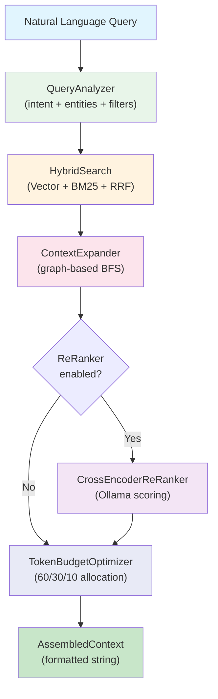
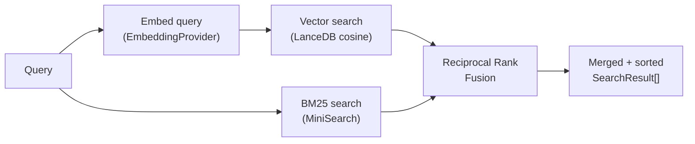
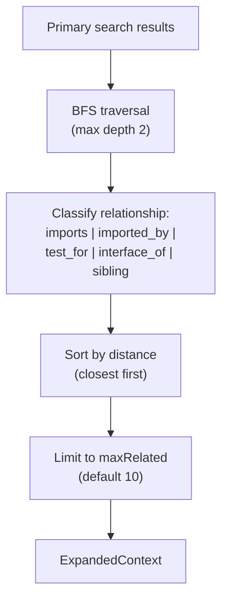
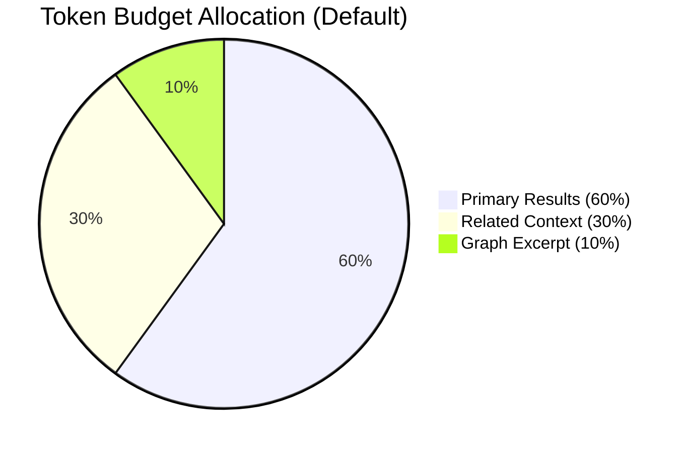
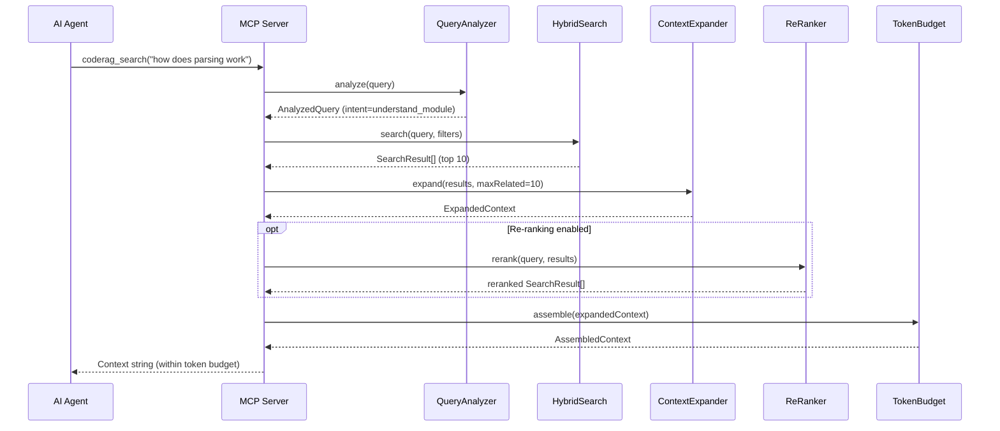

---
tags:
  - architecture
  - pipeline
  - retrieval
  - search
  - mcp
aliases:
  - Retrieval Pipeline
  - Search Pipeline
  - Query Pipeline
---

# Retrieval Pipeline

The retrieval pipeline transforms a natural language query into a token-budgeted context window suitable for an AI agent. It orchestrates query understanding, hybrid search, graph expansion, optional re-ranking, and context assembly.

## Pipeline Overview



## Stage 1: Query Analysis

The `QueryAnalyzer` performs pattern-based query understanding without requiring an LLM. It is a pure function that analyzes the natural language query to detect intent, extract entities, suggest filters, and expand search terms.

### Five Query Intents

| Intent | Example Triggers | Description |
|--------|-----------------|-------------|
| `find_definition` | "where is X defined", "definition of", "show me the definition" | Locate a symbol's declaration |
| `find_usage` | "who calls X", "usage of", "references to", "consumers of" | Find where a symbol is used |
| `understand_module` | "how does X work", "explain", "what does X do", "overview of" | Understand a module's purpose |
| `find_similar` | "similar to X", "alternatives to", "related to" | Find code with similar semantics |
| `general` | Any query not matching above patterns | Default broad search |

### Entity Extraction

Entities are extracted from the query using pattern matching:

- **File paths** -- detected via path-like patterns (`src/foo/bar.ts`)
- **Class names** -- PascalCase identifiers (`TreeSitterParser`, `DependencyGraph`)
- **Function names** -- camelCase identifiers (`buildFromFiles`, `detectChanges`)
- **Common English words** are filtered out to avoid false positives

### Filter Suggestion

The analyzer detects language mentions (`typescript`, `python`, `go`) and chunk type mentions (`function`, `class`, `interface`) to suggest `SearchFilters` that narrow the search space.

### Term Expansion

Query terms are expanded with related synonyms from a built-in map:

```
"test"   -> ["test", "spec", "describe", "it", "expect", "assert"]
"error"  -> ["error", "exception", "throw", "catch", "fail"]
"config" -> ["config", "configuration", "settings", "options", "preferences"]
"auth"   -> ["auth", "authentication", "authorization", "login", "session", "token"]
"api"    -> ["api", "endpoint", "route", "handler", "controller"]
```

```typescript
interface AnalyzedQuery {
  originalQuery: string;
  intent: QueryIntent;
  entities: QueryEntity[];
  suggestedFilters: SearchFilters;
  expandedTerms: string[];
}
```

## Stage 2: Hybrid Search

The `HybridSearch` engine combines vector similarity and BM25 keyword matching using Reciprocal Rank Fusion. See [[hybrid-search]] for the full algorithm.



| Step | Detail |
|------|--------|
| **Vector search** | Embed the query, find top `2*topK` nearest vectors via cosine similarity |
| **BM25 search** | Tokenize the query, find top `2*topK` by term frequency (boosted: nlSummary 2x, name 1.5x) |
| **RRF fusion** | `score = vectorWeight * (1/(k+rank)) + bm25Weight * (1/(k+rank))` with `k=60` |
| **Deduplication** | Chunks appearing in both result sets are merged, scores combined |
| **Output** | Top `topK` results sorted by fused score descending |

## Stage 3: Context Expansion

The `ContextExpander` augments search results with related code found by walking the [[dependency-graph]].



### Relationship Types

| Type | Detection |
|------|-----------|
| `imports` | Direct outgoing edge from source to related node |
| `imported_by` | Direct incoming edge (related node imports source) |
| `test_for` | Related file matches test patterns (`.test.`, `.spec.`, `__tests__/`) with same base name |
| `interface_of` | Edge type is `implements` |
| `sibling` | Both files share the same directory |

### BFS Expansion

The expander uses a single-pass breadth-first search from each primary result, following both outgoing and incoming edges up to **2 hops**. This captures:

- **Hop 1**: Direct dependencies and dependents
- **Hop 2**: Transitive relationships (e.g., a test file for an interface that the primary result implements)

```typescript
interface ExpandedContext {
  primaryResults: SearchResult[];
  relatedChunks: RelatedChunk[];     // sorted by distance
  graphExcerpt: GraphExcerpt;         // subgraph for visualization
}
```

> [!note] The graph excerpt includes the set of visited nodes and their connecting edges, suitable for rendering a mini dependency diagram in the response.

## Stage 4: Cross-Encoder Re-ranking (Optional)

The `CrossEncoderReRanker` is an optional stage that uses an LLM to re-score search results for relevance.

| Aspect | Detail |
|--------|--------|
| **Implementation** | Sends each result to Ollama with a scoring prompt |
| **Prompt** | `"Rate relevance 0-100 of this code to the query. Reply with ONLY the number."` |
| **Scoring** | Parses integer from LLM response, clamps to [0, 100] |
| **Fallback** | If Ollama is unreachable on the first request, returns `ReRankerError`. Transient errors on later requests assign a default score of 50. |
| **TopN** | Only the top N results are re-ranked; the rest are appended unchanged |
| **Interface** | Implements the `ReRanker` interface for provider swapping |

```typescript
interface ReRanker {
  rerank(query: string, results: SearchResult[]): Promise<Result<SearchResult[], ReRankerError>>;
}
```

> [!warning] Re-ranking adds latency (one LLM call per result). It is best used when precision matters more than speed. For most queries, the hybrid search + RRF fusion produces good enough rankings.

## Stage 5: Token Budget Optimization

The `TokenBudgetOptimizer` assembles the final context string within a configurable token limit.

### Budget Allocation



| Parameter | Default | Description |
|-----------|---------|-------------|
| `maxTokens` | 8,000 | Total token budget for assembled context |
| `reserveForAnswer` | 2,000 | Tokens reserved for the LLM's response |
| `primaryWeight` | 0.6 | Fraction of available budget for primary results |
| `relatedWeight` | 0.3 | Fraction of available budget for related context |
| `graphWeight` | 0.1 | Fraction of available budget for graph excerpt |

### Assembly Pipeline

1. **Calculate available budget**: `maxTokens - reserveForAnswer` = 6,000 tokens
2. **Allocate**: primary = 3,600, related = 1,800, graph = 600
3. **Fill primary results**: sorted by score descending, greedily added until budget exhausted
4. **Fill related chunks**: sorted by distance ascending, greedily added until budget exhausted
5. **Add graph excerpt**: textual representation of nodes and edges, included if it fits
6. **Build formatted string**: Markdown sections with code blocks, file paths, and line ranges

```typescript
interface AssembledContext {
  content: string;            // Final formatted context string
  primaryChunks: SearchResult[];
  relatedChunks: RelatedChunk[];
  tokenCount: number;         // Estimated total tokens
  truncated: boolean;         // Whether results were cut to fit
}
```

> [!info] Token estimation uses `text.length / 4` as a fast approximation. This avoids importing a tokenizer library while staying reasonably accurate for English text and code.

### Output Format

The assembled context is formatted as Markdown:

```markdown
## Primary Results

### functionName (function)
File: src/foo/bar.ts [L10-L45]
NL summary of the function.
```
code block here
```

## Related Context

### TestFile [test_for, distance=1]
File: src/foo/bar.test.ts
```
test code here
```

## Dependency Graph
Nodes: a.ts, b.ts, c.ts
a.ts --[imports]--> b.ts
b.ts --[implements]--> c.ts
```

## End-to-End Flow



## Related Pages

- [[overview]] -- System architecture overview
- [[hybrid-search]] -- Detailed hybrid search and RRF algorithm
- [[dependency-graph]] -- Graph model used by ContextExpander
- [[ingestion-pipeline]] -- How chunks are created and stored
- [[design-decisions]] -- ADR for hybrid search, graph expansion, and token budget
