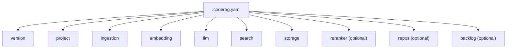

---
tags:
  - getting-started
  - configuration
  - reference
aliases:
  - Configuration Reference
  - Config Reference
  - .coderag.yaml
  - coderag.yaml
---

# Configuration Reference

CodeRAG is configured through a single `.coderag.yaml` file in your project root. This file is created automatically by `coderag init` and can be customized for your setup.

## Config File Structure



## Full Reference

### `version`

| Field | Type | Default | Description |
|-------|------|---------|-------------|
| `version` | `string` | `"1"` | Config schema version. Must not be empty. |

---

### `project`

Project-level metadata used during scanning and language detection.

| Field | Type | Default | Description |
|-------|------|---------|-------------|
| `name` | `string` | `"unnamed"` | Human-readable project name. Must not be empty. |
| `languages` | `string[] \| "auto"` | `"auto"` | List of languages to parse, or `"auto"` for auto-detection. |

**Supported languages for auto-detection:** `typescript`, `javascript`, `python`, `go`, `rust`, `java`, `c_sharp`, `c`, `cpp`, `ruby`, `php`

```yaml
project:
  name: my-api
  languages:
    - typescript
    - python
```

Or let CodeRAG scan your directory:

```yaml
project:
  name: my-api
  languages: auto
```

---

### `ingestion`

Controls how source files are parsed and chunked.

| Field | Type | Default | Description |
|-------|------|---------|-------------|
| `maxTokensPerChunk` | `integer` (positive) | `512` | Maximum number of tokens per code chunk. Chunks exceeding this are split at AST boundaries. |
| `exclude` | `string[]` | `["node_modules", "dist", ".git", "coverage"]` | Directory and file patterns to skip during scanning. |

```yaml
ingestion:
  maxTokensPerChunk: 512
  exclude:
    - node_modules
    - dist
    - .git
    - coverage
    - "*.test.ts"
    - __pycache__
```

> **Tip: > CodeRAG also respects your `.gitignore` file. The `exclude` list is applied on top of `.gitignore` rules.**

---

### `embedding`

Configures the embedding model used to create vector representations of code chunks.

| Field | Type | Default | Description |
|-------|------|---------|-------------|
| `provider` | `string` | `"ollama"` | Embedding provider. Must not be empty. |
| `model` | `string` | `"nomic-embed-text"` | Model name for the chosen provider. Must not be empty. |
| `dimensions` | `integer` (positive) | `768` | Dimensionality of the embedding vectors. Must match the model's output. |

```yaml
embedding:
  provider: ollama
  model: nomic-embed-text
  dimensions: 768
```

> **Warning: > If you change the embedding model or dimensions after indexing, you must re-index with `coderag index --full`. Mixing embeddings from different models in the same index produces incorrect search results.**

---

### `llm`

Configures the language model used for natural language enrichment of code chunks. During indexing, each chunk is summarized in plain English before embedding, which significantly improves search quality.

| Field | Type | Default | Description |
|-------|------|---------|-------------|
| `provider` | `string` | `"ollama"` | LLM provider. Must not be empty. |
| `model` | `string` | `"qwen2.5-coder:7b"` | Model name for NL enrichment. Must not be empty. |

```yaml
llm:
  provider: ollama
  model: "qwen2.5-coder:7b"
```

> **Note: > NL enrichment is the most time-consuming step during indexing. If indexing is too slow, you can use a smaller model like `qwen2.5-coder:1.5b` at the cost of lower summary quality. Subsequent incremental runs only process changed files.**

---

### `search`

Tunes the hybrid search behavior. CodeRAG combines vector (semantic) search with BM25 (keyword) search using Reciprocal Rank Fusion.

| Field | Type | Default | Description |
|-------|------|---------|-------------|
| `topK` | `integer` (positive) | `10` | Maximum number of results to return. |
| `vectorWeight` | `number` (0.0 -- 1.0) | `0.7` | Weight for vector similarity in the fusion score. |
| `bm25Weight` | `number` (0.0 -- 1.0) | `0.3` | Weight for BM25 keyword matching in the fusion score. |

```yaml
search:
  topK: 10
  vectorWeight: 0.7
  bm25Weight: 0.3
```

> **Tip: > For codebases with highly specific identifiers (e.g., internal APIs), increase `bm25Weight` to give keyword matches more influence. For natural-language queries ("how does X work?"), the default semantic-heavy weighting works best.**

---

### `storage`

Configures where the index data (vector embeddings, BM25 index, dependency graph, index state) is stored.

| Field | Type | Default | Description |
|-------|------|---------|-------------|
| `path` | `string` | `".coderag"` | Path to the storage directory, relative to the project root. Must not be empty. |
| `provider` | `"lancedb" \| "qdrant"` | (none, defaults to LanceDB) | Vector store backend. Optional. |
| `qdrant` | `object` | (none) | Qdrant-specific configuration. Only used when `provider: qdrant`. |
| `qdrant.url` | `string` | (none) | Qdrant server URL (e.g., `http://localhost:6333`). |
| `qdrant.collectionName` | `string` | (none) | Qdrant collection name. |

**LanceDB (default, embedded, zero-infrastructure):**

```yaml
storage:
  path: .coderag
```

**Qdrant (external vector database):**

```yaml
storage:
  path: .coderag
  provider: qdrant
  qdrant:
    url: http://localhost:6333
    collectionName: my-project
```

> **Note: > LanceDB is the recommended default. It stores data locally in the `.coderag/` directory with zero setup. Use Qdrant only if you need a shared vector store across teams or already have a Qdrant deployment.**

---

### `reranker` (optional)

Configures a cross-encoder re-ranker that refines search results after initial retrieval. When enabled, the top results from hybrid search are re-scored using a more powerful model.

| Field | Type | Default | Description |
|-------|------|---------|-------------|
| `enabled` | `boolean` | `false` | Whether re-ranking is active. |
| `model` | `string` | `"qwen2.5-coder:7b"` | Model used for re-ranking. Must not be empty. |
| `topN` | `integer` (1 -- 50) | `20` | Number of candidates to re-rank from the initial retrieval. |

```yaml
reranker:
  enabled: true
  model: "qwen2.5-coder:7b"
  topN: 20
```

> **Tip: > Re-ranking improves precision but adds latency. Enable it when search quality matters more than speed, such as in MCP server mode where agents benefit from higher-quality context.**

---

### `repos` (optional)

Enables multi-repo indexing. When configured, `coderag index` processes each repository independently and stores results in separate sub-directories. Cross-repo search works seamlessly.

| Field | Type | Required | Description |
|-------|------|----------|-------------|
| `path` | `string` | Yes | Absolute path to the repository root. Must not be empty. |
| `name` | `string` | No | Human-readable name for the repo (used in search results). |
| `languages` | `string[]` | No | Override language detection for this repo. |
| `exclude` | `string[]` | No | Additional exclude patterns for this repo. |

```yaml
repos:
  - path: /home/user/projects/api-server
    name: api-server
    languages:
      - typescript
    exclude:
      - dist
      - generated

  - path: /home/user/projects/shared-lib
    name: shared-lib
    languages:
      - typescript
```

> **Note: > Initialize with `coderag init --multi` to generate a config scaffold with the `repos` section pre-populated with commented-out examples.**

---

### `backlog` (optional)

Connects CodeRAG to a project management tool, allowing AI agents to search and reference backlog items via the `coderag_backlog` MCP tool.

| Field | Type | Required | Description |
|-------|------|----------|-------------|
| `provider` | `string` | Yes | Backlog provider name (`ado`, `jira`, `clickup`). |
| `config` | `Record<string, unknown>` | No | Provider-specific configuration (API URLs, tokens, project IDs). Defaults to `{}`. |

```yaml
backlog:
  provider: ado
  config:
    organization: my-org
    project: my-project
```

---

## Example Configurations

### Minimal (local Ollama, single repo)

This is what `coderag init` generates by default:

```yaml
version: "1"
project:
  name: my-project
  languages: auto
ingestion:
  maxTokensPerChunk: 512
  exclude:
    - node_modules
    - dist
    - .git
    - coverage
embedding:
  provider: ollama
  model: nomic-embed-text
  dimensions: 768
llm:
  provider: ollama
  model: "qwen2.5-coder:7b"
search:
  topK: 10
  vectorWeight: 0.7
  bm25Weight: 0.3
storage:
  path: .coderag
```

### With Voyage API Embeddings

For higher quality embeddings using the Voyage API (requires a `VOYAGE_API_KEY` environment variable):

```yaml
version: "1"
project:
  name: my-project
  languages:
    - typescript
    - python
ingestion:
  maxTokensPerChunk: 512
  exclude:
    - node_modules
    - dist
    - .git
    - coverage
embedding:
  provider: voyage
  model: voyage-code-3
  dimensions: 1024
llm:
  provider: ollama
  model: "qwen2.5-coder:7b"
search:
  topK: 15
  vectorWeight: 0.7
  bm25Weight: 0.3
storage:
  path: .coderag
reranker:
  enabled: true
  model: "qwen2.5-coder:7b"
  topN: 30
```

### Multi-Repo with Qdrant

For a team setup indexing multiple repositories into a shared Qdrant instance:

```yaml
version: "1"
project:
  name: platform
  languages: auto
ingestion:
  maxTokensPerChunk: 512
  exclude:
    - node_modules
    - dist
    - .git
    - coverage
    - vendor
embedding:
  provider: ollama
  model: nomic-embed-text
  dimensions: 768
llm:
  provider: ollama
  model: "qwen2.5-coder:7b"
search:
  topK: 20
  vectorWeight: 0.6
  bm25Weight: 0.4
storage:
  path: .coderag
  provider: qdrant
  qdrant:
    url: http://localhost:6333
    collectionName: platform-codebase
reranker:
  enabled: true
  model: "qwen2.5-coder:7b"
  topN: 25
repos:
  - path: /home/user/projects/backend
    name: backend
    languages:
      - typescript
  - path: /home/user/projects/frontend
    name: frontend
    languages:
      - typescript
  - path: /home/user/projects/data-pipeline
    name: data-pipeline
    languages:
      - python
    exclude:
      - __pycache__
      - .venv
backlog:
  provider: jira
  config:
    baseUrl: https://myteam.atlassian.net
    project: PLAT
```

## Validation

CodeRAG validates the configuration file using Zod schemas when loading. If validation fails, you will see a clear error message indicating which field is invalid:

```
Config validation failed: embedding.dimensions: Dimensions must be positive; search.vectorWeight: vectorWeight must be between 0 and 1
```

All sections are **merged with defaults** before validation, so you only need to specify the fields you want to change. Omitted fields use the defaults listed in the tables above.

## Related Pages

- [Installation](../installation.md) --- Prerequisites and setup
- [Quick Start](quick-start.md) --- Get up and running in five minutes
- [Embedding Providers](../guides/embedding-providers.md) --- Detailed guide on switching embedding providers
- [Multi Repo](../guides/multi-repo.md) --- Multi-repository indexing setup
- [Backlog Integration](../guides/backlog-integration.md) --- Connecting Jira, ADO, and ClickUp
