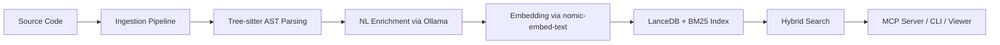

---
tags:
  - getting-started
  - installation
  - setup
aliases:
  - Install CodeRAG
  - Setup
  - Installation Guide
---

# Installation

This guide walks you through installing CodeRAG and its dependencies from scratch.

## Prerequisites

| Requirement | Minimum Version | Purpose |
|-------------|-----------------|---------|
| **Node.js** | >= 20 | Runtime |
| **pnpm** | >= 8 | Package manager (workspaces) |
| **Ollama** | latest | Local embedding + LLM inference |
| **Git** | any recent | Source control, file watcher |

> **Note: > CodeRAG is designed **local-first**. Everything runs on your machine with Ollama and LanceDB --- no cloud accounts required for the default setup.**

## Step 1: Install Node.js and pnpm

If you do not have Node.js 20+ installed, use a version manager like [nvm](https://github.com/nvm-sh/nvm) or [fnm](https://github.com/Schniz/fnm):

```bash
# Using nvm
nvm install 20
nvm use 20

# Verify
node --version   # v20.x.x or higher
```

Install pnpm globally:

```bash
npm install -g pnpm

# Verify
pnpm --version   # 8.x.x or higher
```

## Step 2: Install Ollama

Download and install Ollama from [ollama.com](https://ollama.com/download).

```bash
# macOS (Homebrew)
brew install ollama

# Linux
curl -fsSL https://ollama.com/install.sh | sh
```

Start the Ollama server:

```bash
ollama serve
```

> **Tip: > On macOS, the Ollama desktop app starts the server automatically. You can verify it is running by visiting `http://localhost:11434` in your browser.**

## Step 3: Pull Ollama Models

CodeRAG requires two models --- one for embeddings and one for natural language enrichment:

```bash
# Embedding model (required for indexing and search)
ollama pull nomic-embed-text

# LLM for NL enrichment (required for indexing)
ollama pull qwen2.5-coder:7b
```

> **Warning: > The `qwen2.5-coder:7b` model is approximately 4.7 GB. Make sure you have enough disk space and a stable connection. If your machine has limited RAM (< 8 GB), consider the smaller `qwen2.5-coder:1.5b` variant and update your `.coderag.yaml` accordingly.**

Verify the models are available:

```bash
ollama list
```

You should see both `nomic-embed-text` and `qwen2.5-coder:7b` in the output.

## Step 4: Clone and Install CodeRAG

```bash
git clone https://dev.azure.com/momc-pl/CodeRAG/_git/CodeRAG
cd CodeRAG

# Install all dependencies across workspaces
pnpm install
```

## Step 5: Build

```bash
pnpm build
```

This compiles all packages in the monorepo:

```
packages/
  core/          # Core library
  cli/           # CLI tool (the `coderag` command)
  mcp-server/    # MCP server for AI agents
  viewer/        # Web-based viewer UI
  api-server/    # REST API server
  benchmarks/    # Benchmark suite
  vscode-extension/  # VS Code extension
```

## Step 6: Verify Installation

Run the test suite to confirm everything is working:

```bash
pnpm test
```

You can also verify the CLI is available:

```bash
# From the repo root
npx coderag --version
# 0.1.0
```

> **Tip: > To make the `coderag` command available globally, link the CLI package:**
> ```bash
> cd packages/cli
> pnpm link --global
> ```
> After linking, you can run `coderag` from any directory.

## Verify Ollama Connectivity

The `coderag init` command automatically checks whether Ollama is reachable. You can also test manually:

```bash
curl http://localhost:11434/api/tags
```

If Ollama is running, this returns a JSON list of installed models.

> **Note: > If Ollama is running on a non-default host, set the `OLLAMA_HOST` environment variable:**
> ```bash
> export OLLAMA_HOST=http://my-server:11434
> ```

## Architecture Overview



## Next Steps

- [Quick Start](quick-start.md) --- Initialize and index your first project
- [Configuration](../configuration.md) --- Customize `.coderag.yaml` for your setup
