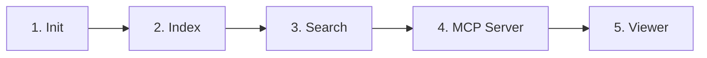
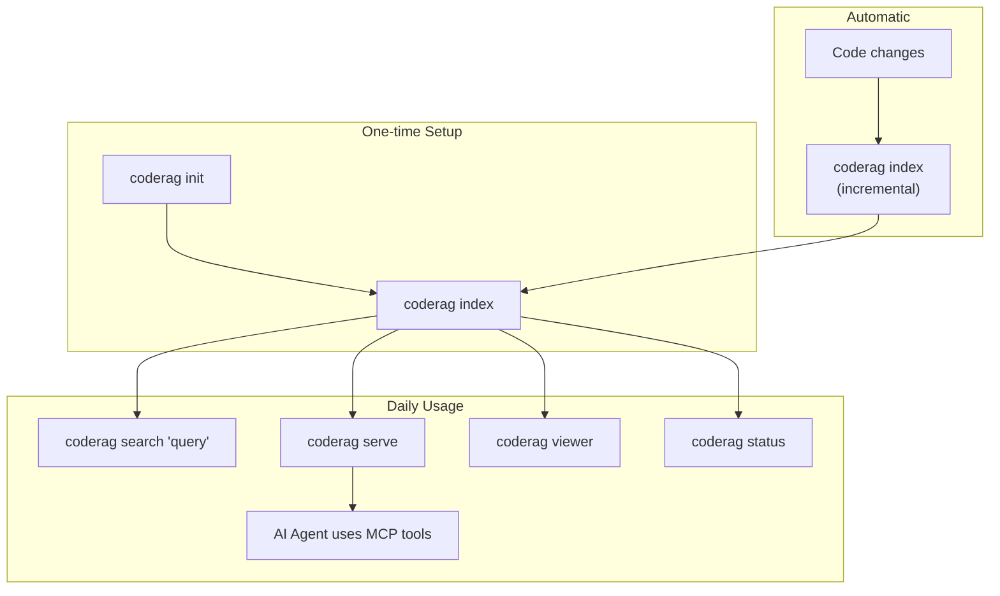

---
tags:
  - getting-started
  - quick-start
  - tutorial
aliases:
  - Quick Start
  - Getting Started Tutorial
  - First Steps
---

# Quick Start

This guide takes you from zero to searching your codebase in five steps. Make sure you have completed the [Installation](../installation.md) steps first.

## Overview



## Step 1: Initialize a Project

Navigate to your project root and run:

```bash
cd /path/to/your/project
coderag init
```

**What happens:**

1. CodeRAG scans your directory to auto-detect programming languages (TypeScript, Python, Go, Rust, Java, C#, C/C++, Ruby, PHP)
2. Creates a `.coderag.yaml` configuration file with sensible defaults
3. Creates the `.coderag/` storage directory for the index data
4. Checks that Ollama is running and reachable

**Expected output:**

```
Scanning for project languages...
Detected languages: python, typescript
Created /path/to/your/project/.coderag.yaml
Created /path/to/your/project/.coderag
✔ Ollama is running at http://localhost:11434

CodeRAG initialized successfully!
Run "coderag index" to index your codebase.
```

**Available options:**

| Flag | Description |
|------|-------------|
| `--languages <langs>` | Override auto-detection with a comma-separated list (e.g., `--languages typescript,python`) |
| `--force` | Overwrite an existing `.coderag.yaml` |
| `--multi` | Generate a multi-repo configuration with a `repos` array |

> **Tip: > If you want to index multiple repositories together, use `coderag init --multi` to generate the multi-repo config scaffold. See [Configuration](../configuration.md) for details.**

## Step 2: Index Your Codebase

```bash
coderag index
```

**What happens (the full ingestion pipeline):**

1. **Scan** --- Discovers source files, respecting `.gitignore` and configured exclusions
2. **Parse** --- Builds an AST for each file using Tree-sitter
3. **Chunk** --- Splits code into semantically meaningful chunks (functions, classes, methods) based on the AST
4. **Enrich** --- Generates natural language summaries for each chunk using Ollama (`qwen2.5-coder:7b`)
5. **Embed** --- Creates vector embeddings using `nomic-embed-text` (768 dimensions)
6. **Store** --- Saves embeddings to LanceDB, builds a BM25 keyword index, and constructs a dependency graph

**Expected output:**

```
◐ Loading configuration...
◐ Scanning files...
◐ Scanned 142 files
◐ Initializing parser...
◐ Parsing 142 files...
◐ Parsed 142 files, created 387 chunks
◐ Enriching 387 chunks with NL summaries...
◐ Embedding 387 chunks...
◐ Storing embeddings in LanceDB...
◐ Building BM25 index...
◐ Building dependency graph...
◐ Saving index state...
✔ Indexing complete!

Summary:
  Files processed: 142
  Chunks created:  387
  Time elapsed:    45.2s
```

**Available options:**

| Flag | Description |
|------|-------------|
| `--full` | Force a complete re-index, ignoring incremental state |

> **Note: > Subsequent runs of `coderag index` are **incremental** --- only changed files are re-processed. Use `--full` if you want to rebuild the entire index from scratch.**

## Step 3: Search Your Codebase

```bash
coderag search "how does authentication work"
```

CodeRAG performs a **hybrid search** combining:
- **Vector search** (semantic similarity, weighted 0.7 by default)
- **BM25 search** (keyword matching, weighted 0.3 by default)
- Results are fused using Reciprocal Rank Fusion (RRF)

**Expected output:**

```
Found 10 result(s) for "how does authentication work":

[1] src/auth/middleware.ts L12-45  function  score: 0.8234
    Middleware that validates JWT tokens and attaches user context to the request

[2] src/auth/provider.ts L8-32  class  score: 0.7891
    Authentication provider that supports OIDC and SAML protocols

[3] src/routes/login.ts L15-67  function  score: 0.7456
    POST /login handler that authenticates users and issues tokens
```

**Available options:**

| Flag | Description |
|------|-------------|
| `--language <lang>` | Filter results by programming language |
| `--type <chunkType>` | Filter by chunk type (`function`, `class`, `method`, etc.) |
| `--file <path>` | Filter by file path substring |
| `--top-k <n>` | Maximum number of results (default: 10) |

**Examples:**

```bash
# Search only in TypeScript files
coderag search "error handling" --language typescript

# Find only class definitions
coderag search "database connection" --type class

# Search within a specific directory
coderag search "validation" --file src/utils

# Get more results
coderag search "configuration" --top-k 20
```

## Step 4: Start the MCP Server

The MCP (Model Context Protocol) server exposes CodeRAG's capabilities as tools that AI coding agents can call directly.

```bash
# stdio transport (for direct agent integration)
coderag serve

# SSE transport (for network access)
coderag serve --port 3000
```

**Expected output (SSE mode):**

```
[coderag] Starting MCP server (SSE transport on port 3000)...
[coderag] MCP server running on http://localhost:3000/sse
```

**Available MCP tools:**

| Tool | Description |
|------|-------------|
| `coderag_search` | Semantic + keyword hybrid search |
| `coderag_context` | Assemble context within a token budget |
| `coderag_status` | Check index health and statistics |
| `coderag_explain` | Explain a code symbol with full context |
| `coderag_docs` | Search indexed documentation |
| `coderag_backlog` | Query project backlog items |

> **Tip: > **stdio transport** is the default and is used when an AI agent spawns the MCP server as a subprocess. Use **SSE transport** with `--port` when you want to connect from a remote client or share the server across multiple agents.**

### Connecting to Claude Desktop

Add the following to your Claude Desktop MCP configuration (`~/Library/Application Support/Claude/claude_desktop_config.json` on macOS):

```json
{
  "mcpServers": {
    "coderag": {
      "command": "npx",
      "args": ["coderag", "serve"],
      "cwd": "/path/to/your/project"
    }
  }
}
```

## Step 5: Open the Viewer

CodeRAG includes a web-based viewer for exploring your indexed codebase visually.

```bash
coderag viewer
```

**Expected output:**

```
[coderag] API server initialized
[coderag] Viewer running at http://localhost:3333
```

The viewer opens automatically in your default browser.

**Available options:**

| Flag | Description |
|------|-------------|
| `-p, --port <port>` | Port number (default: `3333`) |
| `--no-open` | Do not open the browser automatically |

**Viewer features:**

- **Dashboard** --- Overview of index statistics and health
- **Chunk Browser** --- Browse all indexed code chunks with metadata
- **Search Playground** --- Interactive search with result visualization
- **Dependency Graph** --- Interactive graph of code dependencies
- **Embedding Explorer** --- UMAP 2D/3D projection of embedding space

> **Note: > The viewer requires a built viewer package. If you see an error about the viewer not being built, run:**
> ```bash
> pnpm --filter @code-rag/viewer build
> ```

## Check Index Status

At any time, you can check the health of your CodeRAG index:

```bash
coderag status
```

**Expected output:**

```
CodeRAG Status

  Health:       ok
  Total chunks: 387
  Model:        nomic-embed-text
  Dimensions:   768
  Languages:    typescript, python
  Storage:      /path/to/your/project/.coderag
```

Use `--json` for machine-readable output:

```bash
coderag status --json
```

## Complete Workflow Diagram



## Next Steps

- [Configuration](../configuration.md) --- Fine-tune `.coderag.yaml` for your project
- [CLI](../packages/cli.md) --- Full CLI command reference
- [Embedding Providers](../guides/embedding-providers.md) --- Switch between Ollama, Voyage, and OpenAI embeddings
- [Multi Repo](../guides/multi-repo.md) --- Index and search across multiple repositories
