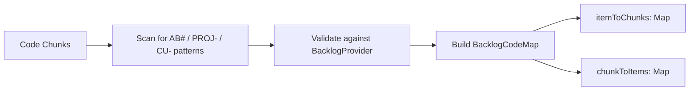

---
tags:
  - guide
  - backlog
  - azure-devops
  - jira
  - clickup
  - integration
aliases:
  - backlog-integration
  - backlog
  - work-items
---

# Backlog Integration

CodeRAG connects to project management tools to index backlog items (epics, stories, tasks, bugs) alongside source code. This lets AI agents answer questions like "what stories are related to the authentication module?" or "which code implements AB#42?"

## Supported Providers

| Provider | Config Name | Reference Pattern | Auth Method |
|----------|-------------|-------------------|-------------|
| Azure DevOps | `azure-devops` | `AB#123` | Personal Access Token (PAT) |
| Jira | `jira` | `PROJ-123` | API Token + Email |
| ClickUp | `clickup` | `CU-abc123` | API Key |

All providers implement the `BacklogProvider` interface:

```typescript
interface BacklogProvider {
  readonly name: string;
  initialize(config: Record<string, unknown>): Promise<Result<void, BacklogError>>;
  getItems(query: BacklogQuery): Promise<Result<BacklogItem[], BacklogError>>;
  getItem(id: string): Promise<Result<BacklogItem, BacklogError>>;
  searchItems(text: string, limit?: number): Promise<Result<BacklogItem[], BacklogError>>;
  getLinkedCode(itemId: string): Promise<Result<string[], BacklogError>>;
}
```

## Configuration

### Azure DevOps

```yaml
backlog:
  provider: azure-devops
  config:
    organization: my-org
    project: my-project
    pat: ${ADO_PAT}
```

| Field | Description |
|-------|-------------|
| `organization` | Azure DevOps organization name |
| `project` | Project name within the organization |
| `pat` | Personal Access Token with Work Items (Read) scope |

**Environment variable**: `ADO_PAT`

> **Tip: > Generate a PAT at `https://dev.azure.com/{org}/_usersSettings/tokens`. Grant it **Work Items: Read** scope at minimum. For linked code detection, also grant **Code: Read**.**

### Jira

```yaml
backlog:
  provider: jira
  config:
    host: my-company.atlassian.net
    email: dev@company.com
    apiToken: ${JIRA_API_TOKEN}
    project: MYPROJ
```

| Field | Description |
|-------|-------------|
| `host` | Jira Cloud hostname (e.g., `my-company.atlassian.net`) |
| `email` | Email associated with the API token |
| `apiToken` | Jira API token |
| `project` | (Optional) Default project key to scope queries |

**Environment variable**: `JIRA_API_TOKEN`

> **Tip: > Create an API token at https://id.atlassian.com/manage-profile/security/api-tokens.**

### ClickUp

```yaml
backlog:
  provider: clickup
  config:
    apiKey: ${CLICKUP_API_KEY}
    teamId: "12345678"
    spaceIds:
      - "90123456"
```

| Field | Description |
|-------|-------------|
| `apiKey` | ClickUp personal API token |
| `teamId` | ClickUp team (workspace) ID |
| `spaceIds` | (Optional) Restrict indexing to specific spaces |

**Environment variable**: `CLICKUP_API_KEY`

## CodeLinker: Connecting Code to Backlog

The `CodeLinker` class creates bidirectional mappings between code chunks and backlog items by scanning for reference patterns in code.

### How It Works



1. **Scan** -- each chunk's content is scanned for reference patterns (e.g., `AB#42`, `PROJ-123`)
2. **Validate** -- each detected reference is resolved against the backlog provider to confirm the item exists
3. **Map** -- valid references produce a `BacklogCodeMap` with two directions:
   - `itemToChunks`: backlog item ID to set of chunk IDs
   - `chunkToItems`: chunk ID to set of backlog item IDs

### Reference Patterns

References are detected in:

- Code comments (`// Implements AB#42`)
- Commit messages (`AB#42 Add auth middleware`)
- Documentation and README files
- String literals and constants

### Coverage Report

The `CodeLinker` can generate a coverage report showing which backlog items have linked code:

```typescript
interface CoverageReport {
  linkedItems: BacklogItem[];     // Items with at least one code chunk
  unlinkedItems: BacklogItem[];   // Items with no linked code
  totalItems: number;
  linkedCount: number;
  unlinkedCount: number;
  coveragePercent: number;        // 0-100
}
```

> **Note: > Coverage percentage helps identify stories that may be missing implementation or whose code lacks proper backlog references.**

## BacklogItem Data Model

Every provider normalizes items to a common structure:

```typescript
interface BacklogItem {
  id: string;                      // Internal numeric ID
  externalId: string;              // Provider-specific: "AB#123", "PROJ-456"
  title: string;
  description: string;
  type: BacklogItemType;           // 'epic' | 'story' | 'task' | 'bug' | 'feature'
  state: string;                   // e.g., "New", "Active", "Resolved", "Closed"
  assignedTo?: string;
  tags: string[];
  linkedCodePaths: string[];       // File paths linked via provider relations
  url?: string;                    // Web URL to view the item
  metadata: Record<string, unknown>; // Provider-specific extras
}
```

## MCP Tool: coderag_backlog

Once configured, the `coderag_backlog` MCP tool is available to AI agents:

```
Tool: coderag_backlog
Parameters:
  - action: "search" | "get" | "linked_code" | "coverage"
  - query: search text (for action=search)
  - id: item ID (for action=get or action=linked_code)
  - types: filter by item type (optional)
  - states: filter by state (optional)
  - limit: max results (optional)
```

### Example Queries

**Search for stories about authentication:**
```json
{
  "action": "search",
  "query": "authentication",
  "types": ["story"],
  "limit": 5
}
```

**Get a specific work item:**
```json
{
  "action": "get",
  "id": "42"
}
```

**Find code linked to a story:**
```json
{
  "action": "linked_code",
  "id": "42"
}
```

**Generate coverage report:**
```json
{
  "action": "coverage"
}
```

> **Warning: > Backlog providers require network access to their respective APIs. Ensure the appropriate environment variables are set and that the machine has connectivity to the provider's API endpoints.**

## See Also

- [Configuration](../configuration.md) -- full `.coderag.yaml` reference
- [MCP Tools](../api-reference/mcp-tools.md) -- all available MCP tools
- [Interfaces](../api-reference/interfaces.md) -- provider interfaces and the provider pattern
