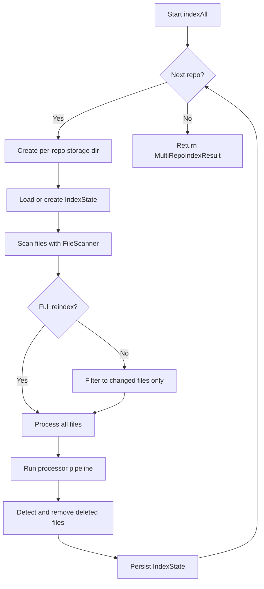

---
tags:
  - guide
  - multi-repo
  - indexing
  - configuration
aliases:
  - multi-repo
  - multi-repository
  - cross-repo
---

# Multi-Repository Support

CodeRAG can index and search across multiple repositories simultaneously. This enables AI agents to understand cross-project dependencies, shared libraries, and monorepo architectures.

## Overview

Multi-repo support is built on two core components:

- **MultiRepoIndexer** -- orchestrates independent indexing runs for each configured repo
- **CrossRepoResolver** -- detects and resolves dependencies between repos by parsing package manifests

Each repository gets its own isolated index state, enabling incremental indexing per repo. Chunk metadata is stamped with the repo name so search results can be filtered or scoped by repository.

## Configuration

Add a `repos` section to your `.coderag.yaml`:

```yaml
version: "1"
project:
  name: my-platform
  languages: auto

repos:
  - path: /home/dev/repos/frontend
    name: frontend
    languages:
      - typescript
      - css
    exclude:
      - dist
      - node_modules

  - path: /home/dev/repos/backend-api
    name: backend-api
    languages:
      - typescript
    exclude:
      - dist
      - node_modules

  - path: /home/dev/repos/shared-lib
    name: shared-lib

ingestion:
  maxTokensPerChunk: 512
  exclude:
    - node_modules
    - dist
    - .git

embedding:
  provider: ollama
  model: nomic-embed-text
  dimensions: 768

storage:
  path: .coderag
```

Each repo entry uses the `RepoConfig` interface:

| Field | Type | Required | Description |
|-------|------|----------|-------------|
| `path` | `string` | Yes | Absolute path to the repository root |
| `name` | `string` | No | Display/storage name. Defaults to the directory basename |
| `languages` | `string[]` | No | Override auto-detected languages |
| `exclude` | `string[]` | No | Additional patterns to exclude (on top of global excludes) |

> **Tip: > If you omit the `name` field, CodeRAG derives it from the last segment of `path`. For example, `/home/dev/repos/backend-api` becomes `backend-api`.**

## How MultiRepoIndexer Works

The `MultiRepoIndexer` processes each configured repo sequentially:



Key behaviors:

- **Fault isolation** -- an error in one repo does not stop indexing of others. Each repo's result includes an `errors` array.
- **Incremental indexing** -- each repo maintains its own `IndexState` at `{storagePath}/{repoName}/index-state.json`. Only files with changed content hashes are re-processed on subsequent runs.
- **Full reindex** -- pass `{ full: true }` to ignore saved state and reprocess everything.
- **Progress reporting** -- an optional `onProgress` callback receives `(repoName, status)` messages for each stage.

> **Note: > The `MultiRepoIndexer` accepts a `RepoProcessor` callback that plugs in the parse/chunk/embed/store pipeline. This allows the CLI and other consumers to customize the processing pipeline per repo.**

## CrossRepoResolver

The `CrossRepoResolver` finds dependencies between repos by analyzing package manifests.

### Supported Manifest Formats

| Format | Dependency Type | Detected By |
|--------|----------------|-------------|
| `package.json` | `npm` | `parsePackageJson()` |
| `go.mod` | `go` | `parseGoMod()` |
| `Cargo.toml` | `cargo` | `parseCargoToml()` |

### Resolution Process

1. **Parse manifests** -- extract the package name and dependency lists from each repo's manifest
2. **Build a lookup** -- map each published package name to its source repo
3. **Match dependencies** -- for each repo, check if any declared dependency matches a package published by another repo
4. **Emit cross-repo edges** -- produce `CrossRepoDependency` records linking source and target repos

```typescript
interface CrossRepoDependency {
  sourceRepo: string;       // Repo that depends on the target
  targetRepo: string;       // Repo that publishes the dependency
  sourceChunkId: string;    // Representative chunk in the source repo
  targetPackage: string;    // Package name of the dependency
  dependencyType: DependencyType; // 'npm' | 'go' | 'cargo' | 'pip' | 'api'
}
```

### Graph Merging

The `mergeGraphs()` method combines per-repo dependency graphs into a unified graph:

- Node IDs are prefixed with the repo name to avoid collisions: `backend-api::src/index.ts`
- Cross-repo edges connect representative nodes between repos
- Placeholder nodes are created for repos without a dependency graph

> **Example: > If `frontend` depends on `shared-lib` via npm, the merged graph will contain an `imports` edge from `frontend::root` to `shared-lib::root`.**

## Storage Layout

Multi-repo indexing creates a directory per repo under the configured storage path:

```
.coderag/
  frontend/
    index-state.json      # Tracks file hashes and chunk IDs
    lancedb/              # Vector embeddings
    bm25-index.json       # Keyword search index
    graph.json            # Dependency graph
  backend-api/
    index-state.json
    lancedb/
    bm25-index.json
    graph.json
  shared-lib/
    index-state.json
    lancedb/
    bm25-index.json
    graph.json
```

## Example: Two-Repo Setup

```yaml
version: "1"
project:
  name: acme-platform
  languages: auto

repos:
  - path: /workspace/acme-api
    name: api
  - path: /workspace/acme-sdk
    name: sdk

embedding:
  provider: ollama
  model: nomic-embed-text
  dimensions: 768

storage:
  path: .coderag
```

Index and search:

```bash
# Index all repos
coderag index

# Search across all repos
coderag search "authentication middleware"

# The MCP server also searches across all indexed repos
coderag serve
```

> **Warning: > When switching from single-repo to multi-repo mode (or vice versa), run a full reindex with `coderag index --full` to ensure consistent state.**

## See Also

- [Configuration](../configuration.md) -- full `.coderag.yaml` reference
- [Dependency Graph](../architecture/dependency-graph.md) -- how the dependency graph works
- [Core](../packages/core.md) -- core library architecture
