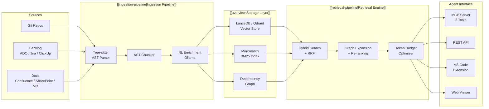

---
tags:
  - home
  - moc
aliases:
  - Home
  - CodeRAG Documentation
  - MOC
---

# CodeRAG Documentation

**CodeRAG** is an intelligent codebase context engine for AI coding agents. It creates a semantic vector database (RAG) from source code, documentation, and project backlog, then exposes it as [[mcp-tools|MCP tools]] that give AI agents deep understanding of the entire codebase.

## Getting Started

| Page | Description |
|------|-------------|
| [[installation]] | Prerequisites, setup, Ollama models |
| [[quick-start]] | First index + search in 5 minutes |
| [[configuration]] | Full `.coderag.yaml` reference |

## Architecture

| Page | Description |
|------|-------------|
| [[overview]] | High-level architecture, tech stack, design principles |
| [[ingestion-pipeline]] | Parse → Chunk → Enrich → Embed → Store |
| [[retrieval-pipeline]] | Query → Analyze → Search → Expand → Budget |
| [[hybrid-search]] | Vector + BM25 + Reciprocal Rank Fusion |
| [[dependency-graph]] | Graph model, edges, BFS expansion |
| [[design-decisions]] | ADR-style rationale for key decisions |

## Packages

| Package | NPM | Description |
|---------|-----|-------------|
| [[core]] | `@code-rag/core` | Shared library — ingestion, embedding, retrieval, auth |
| [[cli]] | `@code-rag/cli` | CLI tool — `coderag init/index/search/serve/status/viewer` |
| [[mcp-server]] | `@code-rag/mcp-server` | MCP server — stdio + SSE transport |
| [[api-server]] | `@code-rag/api-server` | Express REST API — team/cloud deployment |
| [[viewer]] | `@code-rag/viewer` | Vite SPA — dashboard, search, graph, UMAP |
| [[vscode-extension]] | `code-rag-vscode` | VS Code integration — search panel, auto-config |
| [[benchmarks]] | — | Benchmark suite — precision, recall, MRR |

## API Reference

| Page | Description |
|------|-------------|
| [[mcp-tools]] | All 6 MCP tools with schemas and examples |
| [[rest-api]] | All REST endpoints with request/response formats |
| [[types]] | Core TypeScript types (Chunk, SearchResult, Config, ...) |
| [[interfaces]] | Provider interfaces (EmbeddingProvider, VectorStore, ...) |

## Guides

| Page | Description |
|------|-------------|
| [[multi-repo]] | Multi-repository setup and cross-repo resolution |
| [[backlog-integration]] | Azure DevOps, Jira, ClickUp integration |
| [[cloud-deployment]] | API server, Docker, auth, RBAC, team storage |
| [[embedding-providers]] | Ollama, Voyage, OpenAI — setup and comparison |
| [[contributing]] | Development workflow, conventions, testing |

## Reference

| Page | Description |
|------|-------------|
| [[glossary]] | Key terms and definitions |
| [[project-history]] | Sprint timeline, milestones, stats |

---

> [!info] About this documentation
> This vault contains **27 interconnected pages** covering the full CodeRAG system. Use Obsidian's graph view to explore relationships between concepts, or navigate via the links above.

> [!tip] Quick links
> - **I want to use CodeRAG** → Start with [[installation]] → [[quick-start]]
> - **I want to understand how it works** → Read [[overview]] → [[ingestion-pipeline]] → [[retrieval-pipeline]]
> - **I want to integrate with my AI agent** → See [[mcp-tools]] or [[rest-api]]
> - **I want to contribute** → Read [[contributing]] → [[design-decisions]]
