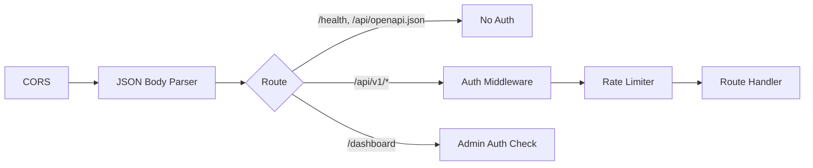

---
tags:
  - package
  - api-server
  - rest
  - cloud
aliases:
  - "@code-rag/api-server"
  - api-server-package
  - REST API
---

# @code-rag/api-server

An Express-based REST API server that provides authenticated HTTP access to CodeRAG's search, context, indexing, and team collaboration features. Designed for cloud deployments and multi-user teams.

**Package**: `@code-rag/api-server`
**Version**: 0.1.0
**Dependencies**: `@code-rag/core`, `express`, `zod`

## ApiServer Class

```typescript
import { ApiServer } from '@code-rag/api-server';

const server = new ApiServer({
  rootDir: '/path/to/project',
  port: 3100,
});
await server.initialize();
await server.start();
```

### Constructor Options

| Option | Type | Default | Description |
|--------|------|---------|-------------|
| `rootDir` | `string` | (required) | Project root directory |
| `port` | `number` | 3100 | HTTP listen port |
| `apiKeys` | `ApiKeyEntry[]` | from env | Parsed API keys (overrides `CODERAG_API_KEYS`) |
| `onIndex` | `IndexTriggerCallback` | `null` | Custom callback for index trigger endpoint |
| `corsOrigin` | `string` | `'*'` | CORS `Access-Control-Allow-Origin` value |

## Middleware Stack

Requests pass through middleware in this order:



1. **CORS** -- sets `Access-Control-Allow-Origin`, handles OPTIONS preflight
2. **JSON body parser** -- `express.json()`
3. **Auth middleware** -- applied to `/api/v1/*` routes (see Auth section below)
4. **Rate limiter** -- applied after auth to enable per-key tracking
5. **Request tracker** -- records all requests for dashboard analytics

## Endpoint Groups

### Unauthenticated

| Method | Path | Description |
|--------|------|-------------|
| GET | `/health` | Health check (`{ status: "ok", timestamp }`) |
| GET | `/api/openapi.json` | OpenAPI 3.0 specification |

### Authenticated (`/api/v1/*`)

| Group | Path Prefix | Description |
|-------|-------------|-------------|
| Search | `/api/v1/search` | Hybrid search with optional re-ranking |
| Context | `/api/v1/context` | File context assembly with graph expansion |
| Status | `/api/v1/status` | Index health and statistics |
| Index | `/api/v1/index` | Trigger re-indexing |
| Team | `/api/v1/team` | Team shared context, connect/analytics |
| History | `/api/v1/history` | User search history |
| Bookmarks | `/api/v1/bookmarks` | User bookmarks |
| Viewer | `/api/v1/viewer` | Read-only visualization API (stats, chunks, graph, search, embeddings) |

### Dashboard (`/dashboard`)

| Method | Path | Description |
|--------|------|-------------|
| GET | `/dashboard` | Server-rendered admin dashboard (HTML) |

The dashboard is admin-only and handles its own authentication. It displays request tracking, API key usage, index statistics, and system health.

## Authentication

The API server uses API key authentication. Keys are provided via the `CODERAG_API_KEYS` environment variable.

### Key Format

```bash
# Comma-separated key:label pairs
CODERAG_API_KEYS="sk-abc123:my-app,sk-xyz789:ci-pipeline"
```

### Request Authentication

Clients authenticate using either:

- **Bearer token**: `Authorization: Bearer sk-abc123`
- **X-API-Key header**: `X-API-Key: sk-abc123`

### Admin Access

Keys ending with `-admin` suffix receive admin privileges, which grant access to the dashboard and index trigger endpoints.

> **Warning: > If `CODERAG_API_KEYS` is not set, the server starts without authentication. This is acceptable for local development but should never be used in production.**

## Rate Limiting

Rate limiting is configured via environment variables:

| Environment Variable | Default | Description |
|---------------------|---------|-------------|
| `CODERAG_RATE_LIMIT_WINDOW_MS` | `60000` | Time window in milliseconds |
| `CODERAG_RATE_LIMIT_MAX_REQUESTS` | `100` | Maximum requests per window |

Rate limiting is applied per API key after authentication.

## Docker Support

The API server can be containerized. The `package.json` includes a `start` script:

```bash
# Direct start
node dist/index.js

# Or via npm
pnpm --filter @code-rag/api-server start
```

A typical Docker setup would:

1. Build the TypeScript source
2. Copy `dist/` and `node_modules/` into the container
3. Set `CODERAG_API_KEYS` and other env vars
4. Expose the configured port

## Testing

The `getApp()` method exposes the Express app for testing with supertest:

```typescript
import { ApiServer } from '@code-rag/api-server';
import request from 'supertest';

const server = new ApiServer({ rootDir: '/tmp/test', port: 0 });
await server.initialize();

const res = await request(server.getApp()).get('/health');
expect(res.status).toBe(200);
```

## See Also

- [REST API](../api-reference/rest-api.md) -- full endpoint reference with request/response schemas
- [Cloud Deployment](../guides/cloud-deployment.md) -- deployment guide for production environments
