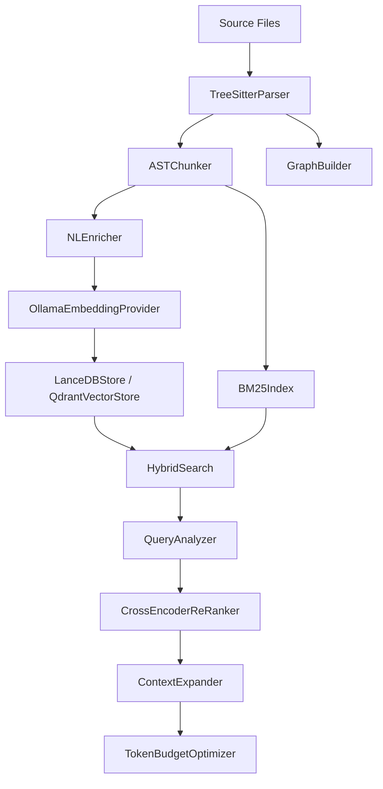

---
tags:
  - package
  - core
  - library
aliases:
  - "@code-rag/core"
  - core-package
---

# @code-rag/core

The shared core library that powers every other CodeRAG package. It contains the full ingestion pipeline, embedding and storage providers, retrieval engine, dependency graph, authentication, cloud storage, backlog integrations, and documentation parsers.

All external functionality is accessed through provider interfaces, making it easy to swap implementations without changing consuming code.

## Module Map

| Directory     | Key Exports                                                                                                                                                               | Purpose                                                                     |
| ------------- | ------------------------------------------------------------------------------------------------------------------------------------------------------------------------- | --------------------------------------------------------------------------- |
| `types/`      | `Chunk`, `ChunkMetadata`, `ChunkType`, `CodeRAGConfig`, `SearchResult`, `SearchQuery`, `EmbeddingProvider`, `VectorStore`, `LLMProvider`, `Parser`, `Chunker`, `ReRanker` | Shared TypeScript types and provider interfaces                             |
| `config/`     | `loadConfig`, `ConfigError`, `repoConfigSchema`                                                                                                                           | `.coderag.yaml` parser with Zod validation                                  |
| `parser/`     | `TreeSitterParser`, `LanguageRegistry`, `MarkdownParser`, `parseFrontmatter`, `extractWikilinks`, `extractTags`                                                           | Tree-sitter WASM code parsing and Markdown parsing                          |
| `chunker/`    | `ASTChunker`, `ASTChunkerConfig`                                                                                                                                          | AST-based semantic chunking (functions, classes, methods)                   |
| `enrichment/` | `OllamaClient`, `NLEnricher`, `EnrichmentError`                                                                                                                           | Natural language summary generation via Ollama                              |
| `embedding/`  | `OllamaEmbeddingProvider`, `ModelLifecycleManager`, `LanceDBStore`, `QdrantVectorStore`, `BM25Index`, `HybridSearch`                                                       | Embedding generation, model lifecycle, vector storage, keyword index, hybrid search with RRF |
| `graph/`      | `DependencyGraph`, `GraphBuilder`, `extractImports`, `CrossRepoResolver`                                                                                                  | Import-based dependency graph construction and cross-repo resolution        |
| `retrieval/`  | `QueryAnalyzer`, `ContextExpander`, `TokenBudgetOptimizer`, `CrossEncoderReRanker`                                                                                        | Query analysis, graph expansion, token budget assembly, re-ranking          |
| `indexer/`    | `IndexState`, `FileScanner`, `IncrementalIndexer`, `MultiRepoIndexer`, `computeFileHash`                                                                                  | File scanning, incremental indexing, multi-repo orchestration               |
| `git/`        | `SimpleGitClient`, `createIgnoreFilter`, `GitError`                                                                                                                       | Git integration via simple-git, `.gitignore` filtering                      |
| `backlog/`    | `AzureDevOpsProvider`, `JiraProvider`, `ClickUpProvider`, `CodeLinker`, `scanForABReferences`                                                                             | Project backlog integrations and code-to-work-item linking                  |
| `docs/`       | `ConfluenceProvider`, `SharePointProvider`, `confluenceStorageToPlainText`, `extractTextFromDocx`, `extractTextFromPdf`                                                   | Documentation source integrations                                           |
| `auth/`       | `RBACManager`, `OIDCProvider`, `SAMLProvider`, `AuditLogger`, `ROLE_HIERARCHY`                                                                                            | Authentication, authorization, and audit logging                            |
| `storage/`    | `S3StorageProvider`, `AzureBlobStorageProvider`, `GCSStorageProvider`                                                                                                     | Cloud storage providers for team index sharing                              |

## Key Dependencies

| Dependency | Version | Purpose |
|-----------|---------|---------|
| `web-tree-sitter` | ^0.24.7 | WASM-based code parsing |
| `tree-sitter-wasms` | ^0.1.13 | Pre-compiled language grammars |
| `@lancedb/lancedb` | ^0.26.2 | Embedded vector database |
| `@qdrant/js-client-rest` | ^1.17.0 | Qdrant vector store client |
| `minisearch` | ^7.2.0 | BM25 keyword search index |
| `neverthrow` | ^8.1.1 | Result<T, E> error handling |
| `simple-git` | ^3.32.0 | Git operations |
| `yaml` | ^2.7.0 | YAML config parsing |
| `zod` | ^4.3.6 | Schema validation |
| `ignore` | ^7.0.5 | Gitignore-style file filtering |

## Architecture

> **Tip: Provider Pattern**
> All external dependencies are behind interfaces (`EmbeddingProvider`, `VectorStore`, `LLMProvider`, `BacklogProvider`, `CloudStorageProvider`, `AuthProvider`). Swap implementations by providing a different concrete class.

## See Also

- [Interfaces](../api-reference/interfaces.md) -- full list of provider interfaces
- [Types](../api-reference/types.md) -- shared TypeScript type definitions
- [Ingestion Pipeline](../architecture/ingestion-pipeline.md) -- detailed ingestion flow
- [Retrieval Pipeline](../architecture/retrieval-pipeline.md) -- detailed retrieval flow
