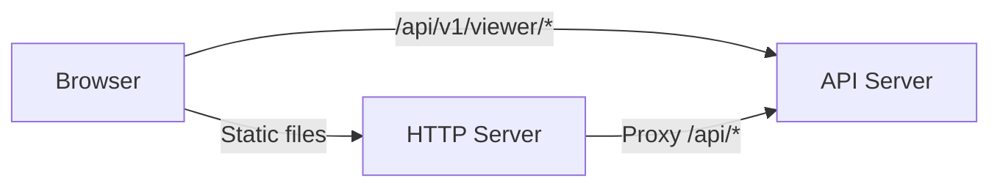

---
tags:
  - package
  - viewer
  - spa
  - visualization
aliases:
  - "@code-rag/viewer"
  - viewer-package
  - CodeRAG Viewer
---

# @code-rag/viewer

A lightweight single-page application for visually exploring a CodeRAG index. Built with vanilla TypeScript and DOM APIs (no framework), bundled with Vite, and designed to run alongside the API server.

**Package**: `@code-rag/viewer` (private)
**Build**: `vite` + `tsc`
**Dev dependencies**: `vite`, `jsdom` (for testing), `vitest`
**Runtime dependencies**: none (zero-dependency SPA)

## Architecture

The viewer is a pure client-side SPA that communicates with the `@code-rag/api-server` REST endpoints. It is served either by `coderag viewer` (which proxies API requests) or can be deployed as static files behind any web server that proxies `/api/` to the API server.



## Hash-Based Routing

The viewer uses URL hash routing (`#/view?params`). The `parseHash()` function maps the hash to one of the five views, falling back to `dashboard` for unknown routes.

```
#/dashboard      --> Dashboard view
#/chunks         --> Chunk Browser view
#/search         --> Search Playground view
#/graph          --> Dependency Graph view
#/embeddings     --> Embedding Explorer view
```

The `navigate(view, params?)` function updates `window.location.hash` to trigger route changes. Each view module implements a `render(container)` and `destroy()` lifecycle.

## Views

### Dashboard (`#/dashboard`)

The landing page showing high-level index statistics:

- Total chunks, total files, total embeddings
- Language distribution breakdown
- Last indexed timestamp
- Quick links to other views

### Chunk Browser (`#/chunks`)

A paginated, filterable table of all indexed code chunks:

- Columns: file path, name, kind (function/class/method), language, line range
- Filters: language, chunk type, file path substring
- Pagination with configurable page size
- Click a chunk to see full detail: content, NL summary, dependencies, and raw embedding vector

### Search Playground (`#/search`)

An interactive search interface for testing queries against the index:

- Text input for natural language queries
- Adjustable parameters: top-K, vector weight, BM25 weight
- Results display: chunk ID, score, file path, name, kind, snippet
- Timing information (query duration in milliseconds)

### Dependency Graph (`#/graph`)

A visual representation of the codebase dependency graph:

- Nodes represent files with their exported symbols
- Edges represent import/dependency relationships with type labels
- Optional filtering by root node ID, traversal depth, and edge kinds
- Interactive layout for exploring module relationships

### Embedding Explorer (`#/embeddings`)

A scatter plot visualization of embedding vectors projected to 2D/3D using UMAP:

- **UMAP implementation**: pure TypeScript, zero external dependencies
- **Projections**: 2D scatter plot and 3D scatter plot
- **Color modes**: 3 modes available -- color by language, by chunk type, or by file path cluster
- Points are interactive: hover to see chunk details
- Configurable limit on number of embedding points to load

> **Tip: > The UMAP implementation runs entirely in the browser. For large codebases (10,000+ chunks), consider limiting the number of embeddings loaded to keep the visualization responsive.**

## Theme Toggle

The viewer supports light and dark themes. The theme preference is persisted in `localStorage` and toggled via a button in the sidebar. The `initTheme()` function loads the saved preference on startup.

## API Client

The `createApiClient()` factory returns an `ApiClient` object that wraps all viewer REST endpoints:

| Method | Endpoint | Description |
|--------|----------|-------------|
| `getStats()` | `GET /api/v1/viewer/stats` | Index statistics |
| `getChunks(params?)` | `GET /api/v1/viewer/chunks` | Paginated chunk list |
| `getChunk(id, includeVector?)` | `GET /api/v1/viewer/chunks/:id` | Single chunk detail |
| `getGraph(params?)` | `GET /api/v1/viewer/graph` | Dependency graph nodes and edges |
| `search(params)` | `GET /api/v1/viewer/search` | Hybrid search |
| `getEmbeddings(limit?)` | `GET /api/v1/viewer/embeddings` | Raw embedding vectors for UMAP |

All methods throw `ApiError` (with `status` and `statusText`) on non-200 responses.

## Building and Running

```bash
# Build the SPA
pnpm --filter @code-rag/viewer build

# Launch via CLI (includes API proxy)
coderag viewer

# Or use Vite dev server (needs separate API server)
pnpm --filter @code-rag/viewer dev
```

## See Also

- [API Server](api-server.md) -- the REST API that powers the viewer
- [CLI](cli.md) -- the `coderag viewer` command
