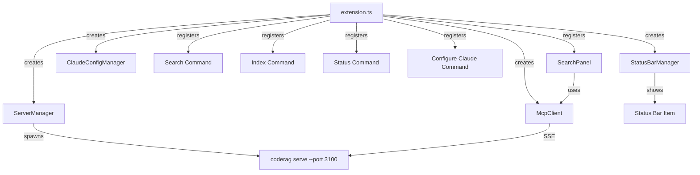

---
tags:
  - package
  - vscode
  - extension
  - ide
aliases:
  - code-rag-vscode
  - vscode-extension-package
  - VS Code Extension
---

# CodeRAG VS Code Extension

A VS Code extension that integrates CodeRAG directly into the editor. It auto-starts the MCP server, connects via SSE, provides search commands, a sidebar webview, and auto-configures Claude Code for MCP access.

**Package**: `code-rag-vscode`
**Publisher**: `coderag`
**Engine**: VS Code ^1.85.0
**Build**: esbuild (bundled CJS)

## Activation

The extension activates when the workspace contains a `.coderag.yaml` file:

```json
"activationEvents": ["workspaceContains:.coderag.yaml"]
```

On activation, the extension:

1. Creates an output channel (`CodeRAG`)
2. Initializes the status bar
3. Detects Claude Code and auto-writes MCP config if needed
4. Starts the MCP server via `ServerManager`
5. Connects the `McpClient` over SSE to `localhost:3100`
6. Fetches initial index status and updates the status bar

## Commands

| Command ID | Title | Description |
|-----------|-------|-------------|
| `coderag.search` | CodeRAG: Search | Opens a search input, queries the MCP server, and displays results |
| `coderag.index` | CodeRAG: Index | Triggers a re-index of the codebase |
| `coderag.status` | CodeRAG: Status | Shows index health, chunk count, and model info |
| `coderag.configureClaude` | CodeRAG: Configure Claude Code | Manually writes Claude Code MCP settings |

## Components



### ServerManager

Manages the lifecycle of the `coderag serve` process:

- Auto-starts `coderag serve --port 3100` as a child process
- Monitors process health via `ensureRunning()`
- Stops the server on extension deactivation
- Logs server output to the CodeRAG output channel

### McpClient

Connects to the MCP server over SSE transport:

- Endpoint: `http://localhost:3100/sse`
- Provides methods for search, index, and status operations
- Handles connection lifecycle (connect/disconnect)
- Default port: `3100`

### StatusBarManager

Displays a status bar item in the VS Code footer:

- Shows connection state: `connected`, `disconnected`, `error`
- Displays the current chunk count when connected
- Updates on index operations and connection state changes

### ClaudeConfigManager

Auto-configures Claude Code to use the CodeRAG MCP server:

- Detects whether Claude Code is installed
- Checks if `.claude/settings.json` already has CodeRAG configured
- Writes the MCP server configuration pointing to `http://localhost:3100/sse`
- Runs automatically on activation (if Claude Code is detected and not yet configured)
- Can also be triggered manually via the `coderag.configureClaude` command

### SearchPanel

A webview sidebar panel for interactive search:

- Registered as a webview view in the `coderag-sidebar` activity bar container
- Provides a search input with real-time results
- Results show file paths, chunk types, scores, and snippets
- Click results to open the corresponding file in the editor

## Sidebar

The extension contributes an activity bar container:

```json
{
  "viewsContainers": {
    "activitybar": [{
      "id": "coderag-sidebar",
      "title": "CodeRAG",
      "icon": "$(search)"
    }]
  },
  "views": {
    "coderag-sidebar": [{
      "type": "webview",
      "id": "coderag.searchPanel",
      "name": "Search"
    }]
  }
}
```

## Extension Lifecycle

| Event | Action |
|-------|--------|
| Activate | Create managers, register commands, auto-configure Claude, start server, connect client |
| Deactivate | Disconnect MCP client, stop server, dispose status bar |
| SIGINT/SIGTERM | Server manager cleans up child process |

> **Note: > Commands are registered and available even before the server connects. If the server is unavailable, commands will show appropriate error messages.**

## See Also

- [MCP Server](mcp-server.md) -- the MCP server that the extension connects to
- [CLI](cli.md) -- the `coderag serve` command used by `ServerManager`
