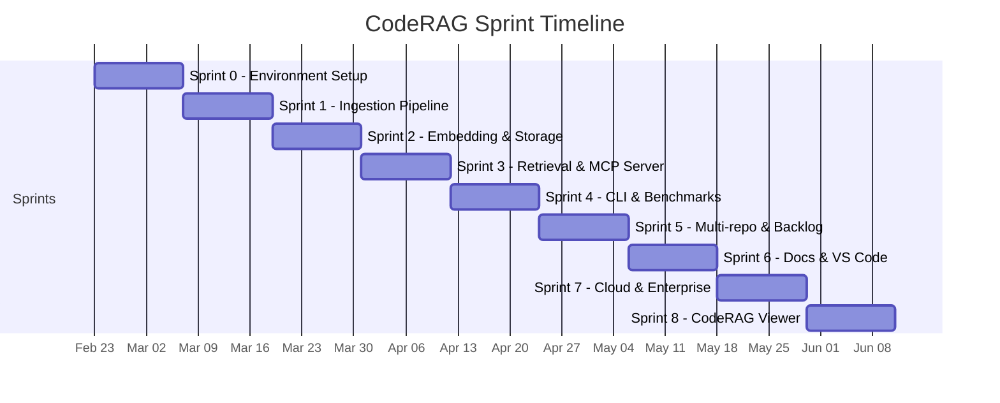

---
tags:
  - reference
  - history
  - sprints
  - timeline
aliases:
  - project-history
  - sprint-history
  - timeline
---

# Project History

CodeRAG was developed over 9 sprints using AI coding agents in a fully automated development workflow. This page documents the project timeline, sprint deliverables, and final statistics.

## Project Timeline

## Sprint Summary

| Sprint | Stories | Story Points | Focus Area | Key Deliverables |
|--------|---------|-------------|------------|------------------|
| 0 | 11 | 30 | Environment Setup | Project scaffolding, monorepo, CI, base types |
| 1 | 8 | 41 | Ingestion Pipeline | Tree-sitter parser, AST chunker, NL enricher, incremental indexer, git integration |
| 2 | 4 | 23 | Embedding & Storage | Ollama embedding provider, LanceDB store, BM25 index, hybrid search with RRF |
| 3 | 8 | 37 | Retrieval & MCP Server | Query analyzer, context expander, token budget, MCP server, 4 MCP tools, cross-encoder re-ranker |
| 4 | 11 | 31 | CLI & Benchmarks | 6 CLI commands (init, index, search, serve, status, publish), benchmark suite, SSE transport |
| 5 | 10 | 47 | Multi-repo & Backlog | Multi-repo indexer, cross-repo resolver, ADO/Jira/ClickUp providers, code linker, Qdrant store |
| 6 | 7 | 35 | Docs & VS Code | Markdown parser, Confluence/SharePoint providers, coderag_docs tool, VS Code extension |
| 7 | 4 | 37 | Cloud & Enterprise | API server (Express), OIDC/SAML auth, RBAC, S3/Azure/GCS storage, admin dashboard |
| 8 | 8 | 50 | CodeRAG Viewer | REST API (6 endpoints), Vite SPA, dashboard, chunk browser, search playground, dependency graph, UMAP explorer |
| **Total** | **71** | **331** | | |

## Sprint Details

### Sprint 0 -- Environment Setup (30 SP)

Established the project foundation: pnpm monorepo with 4 initial packages (core, cli, mcp-server, benchmarks), TypeScript strict configuration, Vitest test runner, base type definitions, and configuration schema with Zod validation. Created the CI pipeline and Docker setup.

**Stories**: 11 stories covering project scaffolding, package structure, type system, and tooling.

### Sprint 1 -- Ingestion Pipeline (41 SP)

Built the complete code ingestion pipeline. Tree-sitter WASM bindings parse source code into ASTs. The AST-based chunker splits code at semantic boundaries (functions, classes, modules) rather than arbitrary line counts. NL enrichment translates code chunks into natural language descriptions via Ollama. The incremental indexer tracks file hashes and only re-processes changed files. Git integration via simple-git detects repository changes.

**Key modules**: `TreeSitterParser`, `ASTChunker`, `NLEnricher`, `IncrementalIndexer`, `GitIntegration`, `FileWatcher`

### Sprint 2 -- Embedding & Storage (23 SP)

Implemented the embedding and storage layer. The `OllamaEmbeddingProvider` generates vector embeddings locally. `LanceDBStore` persists vectors in an embedded columnar database. `BM25Index` provides keyword search via MiniSearch. `HybridSearch` combines both with Reciprocal Rank Fusion and configurable weights.

**Key modules**: `OllamaEmbeddingProvider`, `LanceDBStore`, `BM25Index`, `HybridSearch`

### Sprint 3 -- Retrieval & MCP Server (37 SP)

Built the retrieval engine and MCP server. `QueryAnalyzer` classifies queries and extracts intent. `ContextExpander` traverses the dependency graph to include related code (tests, interfaces, callers). `TokenBudgetOptimizer` assembles context within the agent's token limit. The MCP server exposes 4 tools: `coderag_search`, `coderag_context`, `coderag_status`, and `coderag_explain`. `CrossEncoderReRanker` re-scores results for improved precision.

**Key modules**: `QueryAnalyzer`, `ContextExpander`, `TokenBudgetOptimizer`, `MCPServer`, `CrossEncoderReRanker`

### Sprint 4 -- CLI & Benchmarks (31 SP)

Delivered the CLI tool with 6 commands: `init` (create .coderag.yaml), `index` (run ingestion pipeline), `search` (query from terminal), `serve` (start MCP server), `status` (show index stats), and npm publish setup. The benchmark suite includes dataset generation, baseline measurements, and performance tracking. Added SSE transport to the MCP server.

**Key modules**: `CLI` (Commander.js), `BenchmarkRunner`, `SSEServerTransport`

### Sprint 5 -- Multi-repo & Backlog (47 SP)

Extended CodeRAG to work across multiple repositories. `MultiRepoIndexer` orchestrates independent indexing per repo. `CrossRepoResolver` detects inter-repo dependencies by parsing package manifests (package.json, go.mod, Cargo.toml). Three backlog providers (Azure DevOps, Jira, ClickUp) index work items alongside code. `CodeLinker` creates bidirectional mappings between backlog items and code via AB#/JIRA-/CU- references. Added Qdrant as an alternative vector store.

**Key modules**: `MultiRepoIndexer`, `CrossRepoResolver`, `AzureDevOpsProvider`, `JiraProvider`, `ClickUpProvider`, `CodeLinker`, `QdrantVectorStore`

### Sprint 6 -- Docs & VS Code (35 SP)

Added documentation source support. `MarkdownParser` indexes Markdown files. `ConfluenceProvider` fetches pages from Atlassian Confluence. `SharePointProvider` indexes Microsoft SharePoint documents. The `coderag_docs` MCP tool enables AI agents to search documentation alongside code. The VS Code extension provides a search panel webview and automatic MCP configuration.

**Key modules**: `MarkdownParser`, `ConfluenceProvider`, `SharePointProvider`, `VSCodeExtension`

### Sprint 7 -- Cloud & Enterprise (37 SP)

Built the API server for team deployments. Express REST API with OpenAPI spec, authentication via API keys (with admin suffix convention), OIDC and SAML providers for enterprise SSO, RBAC with 3 roles (viewer, developer, admin) and 7 actions. Token-bucket rate limiting per API key. S3, Azure Blob, and GCS storage providers for team index sharing. Server-rendered admin dashboard with request tracking.

**Key modules**: `ApiServer`, `RBACManager`, `OIDCProvider`, `SAMLProvider`, `S3StorageProvider`, `AzureBlobProvider`, `GCSProvider`, `DashboardDataCollector`

**New package**: `@code-rag/api-server`

### Sprint 8 -- CodeRAG Viewer (50 SP)

Created a web-based visualization tool for exploring indexed codebases. REST API with 6 endpoints serves data to a Vite SPA. Features include: dashboard with index statistics, chunk browser with filtering, search playground for testing queries, interactive dependency graph visualization, and UMAP embedding projection explorer with 2D/3D scatter plots and 3 color modes. UMAP implementation is pure TypeScript with zero external dependencies.

**Key modules**: `ViewerAPI`, `Dashboard`, `ChunkBrowser`, `SearchPlayground`, `DependencyGraphView`, `UMAPProjection`

**New package**: `@code-rag/viewer`

## Final Statistics

| Metric | Value |
|--------|-------|
| Total sprints | 9 (Sprint 0--8) |
| Total stories | 71 |
| Total story points | 331 |
| Total tests | 1,670 |
| Packages | 8 (core, cli, mcp-server, benchmarks, vscode-extension, api-server, viewer) |
| MCP tools | 6 (search, context, status, explain, docs, backlog) |
| CLI commands | 6 (init, index, search, serve, status, viewer) |
| Embedding providers | 3 (Ollama, Voyage, OpenAI) |
| Vector stores | 2 (LanceDB, Qdrant) |
| Backlog providers | 3 (Azure DevOps, Jira, ClickUp) |
| Doc providers | 3 (Markdown, Confluence, SharePoint) |
| Auth providers | 3 (API Key, OIDC, SAML) |
| Storage providers | 3 (S3, Azure Blob, GCS) |

> [!note]
> CodeRAG was built entirely by AI coding agents using a multi-agent workflow with 6 specialized roles: Product Owner, Architect, Developer, Lead Developer, Reviewer, and Tester. The project dogfoods its own capabilities -- CodeRAG's RAG index is used during development to provide context to the agents building it.

## See Also

- [[overview]] -- what CodeRAG is and how it works
